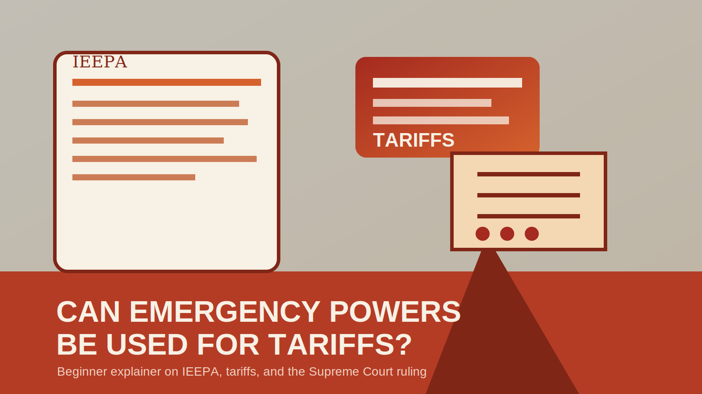
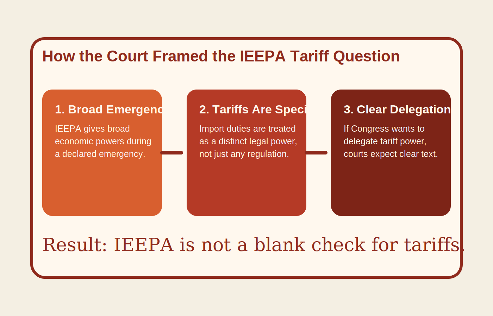

# Can a President Use Emergency Powers to Impose Tariffs?

**SEO title:** Can a President Use Emergency Powers to Impose Tariffs? IEEPA and U.S. Tariff Powers Explained  
**Meta description:** Learn how U.S. tariff powers work, why IEEPA is different from Section 122, Section 232, and Section 301, and what courts have said about emergency tariff authority.  
**Slug:** u-s-tariffs-shift-as-supreme-court-curbs-ieepa  
**Primary keyword:** ieepa tariff  
**Secondary keywords:** supreme court tariffs, tariff supreme court, supreme court ruling on tariffs, trump emergency powers, tariffs illegal  
**Last updated:** May 19, 2026

The short answer is no: a president cannot treat IEEPA as a general tariff statute.

That answer matters because the real question in U.S. trade policy is not whether the government can impose tariffs at all. It is which law authorizes them, how broad that law is, and what limits courts are willing to enforce when the executive branch tries to move fast.

This is where many trade headlines become misleading. IEEPA is a broad emergency economic law, but tariffs are a specific delegated power. That is why courts, lawmakers, importers, and markets all focus on the same core issue: whether the government is using a statute written for sanctions and emergency controls, or a statute written for tariffs and trade remedies.

<strong>What to know:</strong>

- IEEPA is an emergency economic-powers statute, not a clean tariff statute.
- U.S. tariff authority still exists, but it usually runs through narrower laws such as Section 122, Section 232, or Section 301.
- The difference between those laws matters because it affects how fast tariffs can be imposed, how long they can last, and how easy they are to challenge in court.

<figure class="aligncenter">
  
  <figcaption>IEEPA sits inside the broader U.S. emergency-powers toolkit, but that does not make it a general tariff law.</figcaption>
</figure>

## Why This Question Keeps Coming Back

Tariffs are one of the most powerful economic tools available to governments. They can affect:

- import costs
- consumer prices
- supply chains
- inflation expectations
- corporate planning
- market sentiment

Because they are so powerful, the legal source of tariff authority matters almost as much as the tariff itself.

If a president relies on a broad emergency law, the government may be able to move quickly, but the action is more vulnerable to court challenge. If a president relies on a narrower trade statute, the process is usually slower and more constrained, but the legal footing is often stronger.

That tradeoff is what makes this topic evergreen. It is not about one tariff cycle. It is about how the U.S. system allocates tariff power between Congress and the executive branch.

## What IEEPA Actually Does

IEEPA stands for the International Emergency Economic Powers Act. Its text appears in [50 U.S. Code Chapter 35](https://www.law.cornell.edu/uscode/text/50/chapter-35).

In broad terms, the law allows the president to take certain economic actions after declaring a national emergency tied to an unusual and extraordinary threat coming largely from outside the United States.

In practice, IEEPA has been used more naturally for:

- sanctions
- asset blocking
- transaction restrictions
- financial controls involving foreign actors

That history matters because it explains why many legal analysts were skeptical when IEEPA was used as the basis for tariffs. Broad power over foreign economic activity is not the same thing as explicit authority to impose duties on imported goods.

## Why IEEPA Is a Weak Fit for Tariffs

The core legal problem is simple: tariffs are not just any form of regulation.

They are taxes or duties imposed on imported goods, and U.S. law usually treats them as a specific delegated power rather than an implied byproduct of general emergency language.

That is why the [Congressional Research Service legal sidebar](https://www.congress.gov/crs_external_products/LSB/PDF/LSB11332/LSB11332.3.pdf) was so important. CRS noted that before the IEEPA tariff disputes, no president had imposed tariffs under IEEPA. That does not settle the legal issue by itself, but it makes the theory look far less like ordinary statutory practice.

The weak fit shows up in three places:

### 1. Text

IEEPA is broad, but it does not clearly read like a tariff statute.

### 2. Structure

Congress has already written several statutes that do explicitly contemplate tariffs, surcharges, or trade remedies.

### 3. Practice

U.S. trade law already has well-known tariff lanes. Using IEEPA as a catch-all shortcut looks unusual against that backdrop.

## The Main Tariff Statutes to Know

This is the part many readers actually need. If IEEPA is not the clean answer, what statutes are?

| Statute | What it is for | Why it matters |
| --- | --- | --- |
| IEEPA | Emergency economic controls tied to foreign threats | Broad, but not a reliable general tariff statute |
| [Section 122 of the Trade Act of 1974](https://www.law.cornell.edu/uscode/text/19/2132) | Temporary balance-of-payments action | Allows a temporary import surcharge, but only up to 15% and for 150 days unless Congress acts |
| [Section 232 of the Trade Expansion Act of 1962](https://www.law.cornell.edu/uscode/text/19/1862) | National-security-based import action | Tied to a Commerce process and national security findings |
| [Section 301 of the Trade Act of 1974](https://www.law.cornell.edu/uscode/text/19/2411) | Action against unfair foreign trade practices | Built around USTR findings and procedure |

This comparison is the real evergreen framework.

The right question is not "can the White House impose tariffs?" The right question is "under which legal lane, with which trigger, and with which limit?"

## Why Section 122 Matters So Much in This Discussion

Section 122 is often overlooked by readers who only follow trade policy during major disputes, but it matters because it is one of the clearest examples of Congress writing a narrower tariff tool on purpose.

Under [19 U.S.C. 2132](https://www.law.cornell.edu/uscode/text/19/2132), the president can impose a temporary import surcharge of up to 15% for up to 150 days to address large and serious U.S. balance-of-payments deficits.

That matters for three reasons:

- the surcharge cap is explicit
- the time limit is explicit
- the economic purpose is narrower than a general emergency theory

In plain English, Section 122 shows what an actual tariff delegation looks like when Congress wants to write one.

## What the Supreme Court Clarified

The [Supreme Court opinion](https://www.supremecourt.gov/opinions/25pdf/24-1287_new_3135.pdf) and [case docket](https://www.supremecourt.gov/docket/docketfiles/html/public/24-1287.html) are worth reading because they clarified an evergreen legal point: broad emergency language does not automatically create tariff authority.

The narrow but important takeaway is this:

- the Court did not ban all tariffs
- the Court did not erase all executive trade powers
- the Court did say IEEPA does not authorize the president to impose tariffs

That ruling matters as a case study because it reinforces how courts tend to read tariff authority: if Congress means to delegate it, courts expect Congress to say so clearly.

For importers, the practical follow-through is not just constitutional theory but timing, refunds, and customs treatment. That is why our report on [IEEPA tariff refunds moving ahead after the appeals court denied a delay](https://coinlineup.com/ieepa-tariff-refunds-advance-as-appeals-court-denies-delay/) matters at the operational level.

<figure class="aligncenter">
  
  <figcaption>Courts tend to separate broad emergency powers from specific delegated tariff powers.</figcaption>
</figure>

## How to Tell Which Tariff Lane the Government Is Using

If you want to follow tariff policy without getting lost in legal jargon, ask these questions:

### Is the rationale emergency, national security, balance of payments, or unfair trade?

That usually points you toward IEEPA, Section 232, Section 122, or Section 301.

### Does the law expressly contemplate tariffs or surcharges?

If it does not, that is the first red flag.

### Is there a built-in process?

Some tariff statutes require findings, investigations, agency involvement, or time limits. Those constraints are part of the policy story.

### Is the government moving faster than the statute seems designed to allow?

That is often when litigation risk rises.

## Why Markets and Crypto Readers Should Care

This is not just a trade-law issue.

Tariff policy affects:

- inflation expectations
- interest-rate expectations
- supply-chain stability
- business confidence
- risk sentiment across equities and crypto

Crypto is not directly a tariff trade, but it still reacts to the macro channels tariffs can move:

- higher imported-input costs
- inflation pressure
- policy uncertainty
- broader risk-on or risk-off shifts

That does not mean every tariff story is bullish or bearish for digital assets. It means macro-aware crypto readers should understand which tariff lane is actually in play.

If you want the market-facing version of that same issue, our earlier coverage of how [crypto markets reacted as the White House prepared tariff alternatives during Supreme Court review](https://coinlineup.com/crypto-markets-impact-white-house-tariff-alternatives/) is the faster-news counterpart to this legal explainer.

## The Evergreen Takeaway

The most useful long-term lesson is not that one administration won or lost a particular tariff fight.

The real lesson is that U.S. tariff power is fragmented on purpose. Congress has created multiple lanes for multiple situations, and courts are generally reluctant to let a broad emergency statute swallow the narrower tariff statutes Congress wrote more carefully.

That is why this topic stays relevant long after one ruling or one tariff cycle fades from the front page.

## FAQ

### Can a president impose tariffs under IEEPA?

Not as a general matter. Courts have made clear that IEEPA is not a clean general tariff statute.

### Does that mean all tariffs are illegal?

No. Other tariff statutes still exist and remain important.

### Why is Section 122 important?

Because it shows what an explicit temporary tariff delegation looks like: capped, time-limited, and tied to a specific economic rationale.

### Is Section 232 different from IEEPA?

Yes. Section 232 is a national-security trade statute with its own statutory process and findings.

### Why should investors care about tariff statutes?

Because the legal lane affects how quickly tariffs can happen, how durable they look, and how markets price policy risk.

## Sources

- [50 U.S. Code Chapter 35, International Emergency Economic Powers](https://www.law.cornell.edu/uscode/text/50/chapter-35)
- [CRS Legal Sidebar: Court Decisions Regarding Tariffs Imposed Under IEEPA](https://www.congress.gov/crs_external_products/LSB/PDF/LSB11332/LSB11332.3.pdf)
- [19 U.S.C. 2132, Section 122 temporary balance-of-payments authority](https://www.law.cornell.edu/uscode/text/19/2132)
- [19 U.S.C. 1862, Section 232 national security authority](https://www.law.cornell.edu/uscode/text/19/1862)
- [19 U.S.C. 2411, Section 301 authority](https://www.law.cornell.edu/uscode/text/19/2411)
- [U.S. Supreme Court opinion in *Learning Resources, Inc. v. Trump* and *V.O.S. Selections, Inc. v. United States*](https://www.supremecourt.gov/opinions/25pdf/24-1287_new_3135.pdf)
- [Supreme Court docket entry for 24-1287](https://www.supremecourt.gov/docket/docketfiles/html/public/24-1287.html)

## Disclaimer

This article is for educational purposes only and does not constitute legal, tax, investment, or policy advice. Tariff programs, agency action, and court interpretations can change over time.
