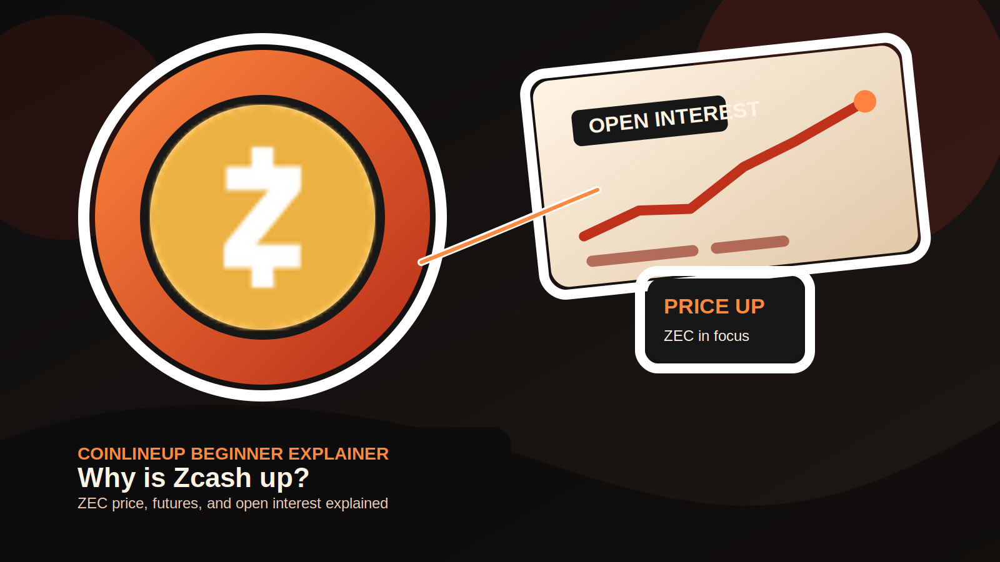
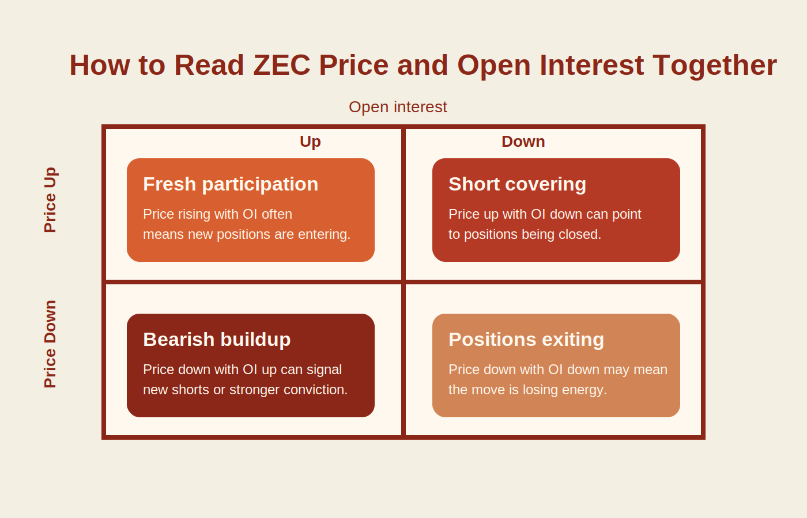

# What Moves Zcash Price?

**SEO title:** What Moves Zcash Price? ZEC, Liquidity, Futures, and Open Interest Explained  
**Meta description:** A research-backed explainer on what moves Zcash price, why ZEC can rally harder than larger coins, and how futures and open interest shape price action.  
**Slug:** zcash-futures-interest-price-surge  
**Primary keyword:** zcash price  
**Secondary keywords:** why is zcash pumping, why zcash is up, zcash, what is zcash, zcash crypto, zec  
**Last updated:** May 19, 2026

Zcash tends to move hardest when a familiar privacy-coin narrative collides with a relatively small market structure and a derivatives complex willing to lean into momentum.

That is the short answer. The longer one is that ZEC does not need Bitcoin-sized inflows to break higher. A modest wave of spot demand can move price quickly, and once futures traders add fresh longs or start covering shorts, the move can accelerate far faster than the underlying catalyst would suggest on paper.

<strong>What to know:</strong>

- Zcash is one of the best-known privacy-focused crypto assets, but its market is still small enough that price can react sharply to moderate inflows.
- Rising open interest matters most when it appears alongside spot volume and narrative rotation, not in isolation.
- A ZEC rally can be real and still be mostly structural rather than adoption-led, which is why traders need to separate market mechanics from long-term utility.

<figure class="aligncenter">
  
  <figcaption>Zcash rallies often draw fresh attention to futures activity, open interest, and short-term market structure.</figcaption>
</figure>

## The Setup in One Table

To ground the thesis, here is a public reference snapshot checked on May 19, 2026 from [CoinMarketCap's Zcash page](https://coinmarketcap.com/currencies/zcash/):

| Metric | Snapshot value | Why it matters |
| --- | --- | --- |
| Price | about $53.55 | Sets the reference point for current market positioning |
| 24-hour volume | about $94.8 million | Shows whether the move is attracting enough turnover to matter |
| Market cap | about $883.7 million | Confirms ZEC is still much smaller than top-tier majors |
| Circulating supply | about 16.5 million ZEC | Helps frame scarcity and float |

The numbers will change. The structure is the real point: ZEC is large enough to stay on traders' screens and small enough to move hard when attention returns.

## Why Zcash Can Move Faster Than Larger Coins

The [official Zcash explainer](https://z.cash/learn/what-is-zcash/) frames the asset around privacy-preserving payments and zero-knowledge technology. That identity matters because ZEC does not trade like a generic layer-1 token or a meme coin.

It trades at the intersection of:

- a recognizable privacy narrative
- a long market history
- thinner liquidity than larger assets
- enough exchange access to become tradable when rotation begins

That combination is important. Traders already know what Zcash is, so they do not need to rediscover the asset from scratch. But the market is still shallow enough that when capital rotates into the name, price can move much more violently than it would in BTC or ETH.

This is why Zcash rallies often feel outsized relative to the immediate headline.

## The Real Chain Behind a ZEC Rally

The cleanest way to think about Zcash price is as a chain, not a single trigger.

### 1. Narrative attention returns

Privacy is not always a leading theme in crypto, but it remains a durable one. When traders rotate toward neglected parts of the market, Zcash often becomes one of the first names revisited because it is recognizable and easy to benchmark against prior cycles.

That rotation usually does not happen in isolation. In our earlier market coverage, Zcash often reappeared when [zero-knowledge narratives and whale demand came back into focus](https://coinlineup.com/zkp-takes-center-stage-with-5m-rewards-as-bch-pushes-toward-1k-and-zcash-sees-whale-demand/).

### 2. Thin liquidity does the first part of the work

With a sub-$1 billion market cap in the current snapshot, ZEC's order book is naturally more sensitive than the order books of larger coins. That means a smaller wave of demand can create a bigger visible price move.

### 3. Futures traders amplify the signal

Once spot demand starts the move, derivatives can take over the short-term expression of it. Fresh longs, short covering, or both can turn a clean breakout into a sharp vertical move.

That three-step chain explains more ZEC rallies than most simple "bullish catalyst" headlines do.

## What Open Interest Actually Tells You

Open interest is useful because it says something about participation, not because it predicts price by itself.

The [CME Group explainer on open interest](https://www.cmegroup.com/education/courses/introduction-to-futures/open-interest) makes the key distinction:

- volume tells you how much traded
- open interest tells you how many contracts remain open

For Zcash, that distinction matters a lot because price alone cannot tell you whether a rally is being driven by:

- fresh speculative longs
- a squeeze on shorts
- position rotation without lasting conviction
- a more balanced mix of spot and futures demand

In a thinner market, those differences are not academic. They shape how durable the move is likely to look.

That framework becomes clearer when you compare it with larger markets too. Our breakdown of how [Ethereum open interest jumped as leverage piled into ETH](https://coinlineup.com/ethereum-open-interest-jumps-11-6-as-leverage-piles-into-eth/) shows the same mechanic in a deeper asset, where positioning can build without distorting price quite as violently as it can in ZEC.

## Why Derivatives Matter More in Zcash Than in Bigger Assets

The [CFTC glossary](https://www.cftc.gov/LearnAndProtect/AdvisoriesAndArticles/CFTCGlossary/index.htm) is a good baseline reminder that futures let traders express price views with leverage and without spot custody.

For a large asset, that leverage may be absorbed by a deep market. For ZEC, the same leverage can change price behavior much more visibly.

That is why traders should not read a Zcash move the same way they would read a Bitcoin move:

- a spot-led ZEC move can be constructive
- a leverage-led ZEC move can be explosive
- a leverage-only ZEC move can also unwind fast

This is where many shallow "why pump" articles stop too early. They treat any rise in open interest as bullish confirmation. In practice, it is only useful when read alongside the rest of the setup.

The risk on the way back down is just as real. Coinlineup's piece on [crypto liquidations wiping out long positions in 24 hours](https://coinlineup.com/144-million-crypto-liquidations-long-positions-24-hours/) is a useful reminder that leverage can confirm momentum on the way up and accelerate damage once the move breaks.

## How to Read a ZEC Move Properly

### Price up + open interest up

This is usually the cleanest sign that fresh speculative participation is entering with the move. In ZEC, that can reinforce momentum quickly, but it can also signal crowding if leverage builds too fast.

### Price up + open interest down

This usually points more toward short covering than fresh directional conviction. The rally can still be strong, but it may have less staying power if new spot demand fails to replace the squeezed shorts.

### Price up + volume up + privacy rotation

This is the strongest combination because it suggests the move is not just mechanical. It has participation, visibility, and a narrative tailwind at the same time.

### Price up + weak spot confirmation

This is the fragile version of the trade. If derivatives are doing most of the work and spot demand stays thin, the move can reverse quickly.

<figure class="aligncenter">
  
  <figcaption>The most useful framework is to read price direction together with open-interest direction.</figcaption>
</figure>

## The Part Most Traders Miss: Price Strength Is Not the Same as Adoption Strength

This is where Zcash becomes more interesting than a generic trading setup.

The [Zcash Foundation's discussion of adoption challenges](https://zfnd.org/what-is-preventing-zcash-adoption/) argued that limited shielded adoption remains one of the biggest barriers facing the project. That is a meaningful research point because it means price can move faster than utility.

In practice, that means all of the following can be true at once:

- ZEC can post a legitimate rally
- derivatives can confirm the move
- the privacy narrative can be back in focus
- real-world adoption can still be lagging

That is not a contradiction. It is normal market behavior in crypto. But it is exactly the kind of distinction serious readers need if they want to understand whether they are looking at a structural re-rating or a tradable market-structure event.

## Why Continuity Still Matters to the Bull Case

One reason Zcash keeps reappearing on traders' screens is that it is still a living project rather than a purely nostalgic ticker.

[Electric Coin Company's note on the hybrid deferred dev fund extension](https://electriccoin.co/blog/zcash-community-extends-dev-fund-until-next-halving/) matters here because it reinforces two things:

- the ecosystem still has an operating funding path
- the market does not have to price ZEC as a fully abandoned legacy asset

That is not the same as saying the dev fund drives price. It does not. But it reduces one category of structural doubt and helps explain why ZEC remains tradable whenever privacy rotates back into view.

## What Makes a Zcash Move Look Stronger

If you are trying to distinguish a durable move from a one-candle squeeze, the best signs are:

- sustained spot volume, not just derivatives activity
- price holding gains after the first impulse
- open interest rising without becoming obviously overheated
- broader privacy-coin or alt rotation confirmation
- a market narrative that expands instead of disappearing after the breakout

These signs do not guarantee continuation. They simply make the move look more grounded.

## What Makes a Zcash Move Look Weaker

The warning signs are just as important:

- price rising mainly on thin liquidity
- open interest jumping too fast without follow-through
- short covering doing most of the heavy lifting
- fast rejection after the breakout
- no broader narrative support beyond the initial move

ZEC is especially sensitive to these failure modes because the same structure that helps it rally can also make it snap back hard.

## Bottom Line

Zcash price does not usually move because of one clean catalyst. It moves because a familiar privacy-coin narrative meets a relatively small market structure and a derivatives complex that can magnify whatever spot demand appears first.

That is why ZEC can rally harder than larger coins and still leave open a very different question underneath: whether the move is a durable repricing of the asset or a faster, leverage-assisted trading event.

That is the right way to read Zcash. Not as a random altcoin spike, and not as proof that every price move reflects adoption, but as a market where narrative, liquidity, and futures matter more than they do in most larger names.

## FAQ

### Why is Zcash more volatile than Bitcoin?

Because Zcash is much smaller, has thinner liquidity, and is more sensitive to sector rotation and leveraged futures positioning.

### Does rising open interest mean Zcash will keep going up?

No. It can confirm growing participation, but it can also show that the trade is getting crowded and more fragile.

### Is a Zcash rally the same as Zcash adoption improving?

No. Price can move much faster than real utility or shielded-usage adoption improves.

### Why does the privacy narrative matter so much for ZEC?

Because Zcash is one of the most recognizable privacy-focused crypto assets, so it often becomes an early vehicle for that theme when traders rotate back into it.

### What should traders watch besides price?

Watch spot volume, open-interest direction, leverage conditions, and whether the move holds after the first breakout impulse.

## Sources

- [CoinMarketCap Zcash page](https://coinmarketcap.com/currencies/zcash/)
- [Zcash official explainer: What is Zcash?](https://z.cash/learn/what-is-zcash/)
- [CME Group: Open Interest](https://www.cmegroup.com/education/courses/introduction-to-futures/open-interest)
- [CFTC Futures Glossary](https://www.cftc.gov/LearnAndProtect/AdvisoriesAndArticles/CFTCGlossary/index.htm)
- [Electric Coin Company: Zcash community extends dev fund until next halving](https://electriccoin.co/blog/zcash-community-extends-dev-fund-until-next-halving/)
- [Zcash Foundation: What is preventing Zcash adoption?](https://zfnd.org/what-is-preventing-zcash-adoption/)

## Disclaimer

This article is for educational purposes only and does not constitute investment, trading, tax, or legal advice. Public market data can change quickly after publication, and leveraged crypto trading involves substantial risk.
