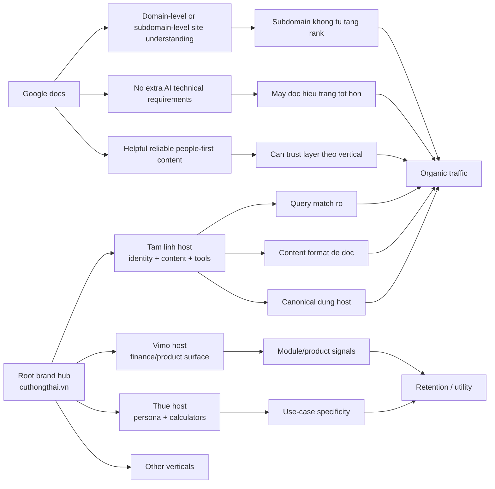

# Cuthongthai.vn: Logic "Tinh Vi" Của Mô Hình Subdomain Khi Đối Chiếu Với Google

Ngày biên soạn: 2026-06-11  
Ngày đối chiếu nguồn Google chính thức: 2026-06-11  
Đối tượng: `https://cuthongthai.vn/` và các subdomain chính  
Ngôn ngữ: Tiếng Việt  
Mục tiêu: giải thích vì sao mô hình nhiều subdomain của `cuthongthai.vn` có thể tạo kết quả traffic tốt mà không ngộ nhận rằng "subdomain tự động rank tốt hơn"

## 1. Kết Luận Ngắn

Điểm "tinh vi" của `cuthongthai.vn` không nằm ở bản thân `subdomain`.

Nó nằm ở chỗ họ đang dùng `subdomain` như một `lớp tổ chức semantic + product + measurement` cùng lúc:

- tách từng cụm intent thành một host có định danh riêng
- viết content và xây tool theo ngữ cảnh rất thuần cho từng vertical
- dồn canonical về vertical muốn thắng
- để mỗi host hành xử như một mini-site có proposition riêng
- trong khi vẫn giữ root domain làm brand hub

Nói ngắn gọn:

`Subdomain ở đây là khung tổ chức tín hiệu, không phải mẹo ranking độc lập.`

## 2. Google Nói Gì Trực Tiếp

Phần này chỉ ghi những gì có thể neo khá chắc vào tài liệu chính thức của Google.

### 2.1 Google có thể hiểu site ở mức domain hoặc subdomain

Trong tài liệu `Site Names in Google Search`, Google ghi rõ:

- site name có thể áp dụng cho `domain-level` và `subdomain-level` sites
- hệ thống site name lấy tín hiệu từ `home page` và các tham chiếu trên web
- `WebSite structured data`, `og:site_name`, `title`, heading và text trên homepage đều có thể được dùng để xác định site name

Ý nghĩa thực dụng:

- Google có một số hệ thống `site-level interpretation`
- ranh giới "site" không nhất thiết chỉ là toàn bộ root domain
- một subdomain có thể được đọc như một thực thể site/source riêng trong một số ngữ cảnh

Nguồn:

- `https://developers.google.com/search/docs/appearance/site-names`

### 2.2 Search Console cũng phản ánh rất rõ logic tách và gộp này

Trong tài liệu `Add a website property to Search Console`, Google phân biệt:

- `Domain property`: bao phủ toàn bộ subdomain và nhiều protocol
- `URL-prefix property`: chỉ đo phần prefix được khai báo

Ý nghĩa thực dụng:

- nếu chủ site dùng nhiều subdomain, họ có thể vừa nhìn `toàn hệ` bằng `Domain property`
- vừa bóc riêng từng host bằng `URL-prefix property`

Điều này không chứng minh subdomain rank tốt hơn.

Nhưng nó chứng minh rằng `Google tooling` và `Google measurement model` hoàn toàn hỗ trợ cách tổ chức nhiều host trong cùng một hệ.

Nguồn:

- `https://support.google.com/webmasters/answer/34592`
- `https://support.google.com/webmasters/answer/10431861`

### 2.3 Với AI features, Google không đòi một lớp tối ưu đặc biệt ngoài nền SEO chuẩn

Trong tài liệu `AI Features and Your Website`, Google nêu:

- để được hiển thị như supporting link trong `AI Overviews` hoặc `AI Mode`, trang phải được index và đủ điều kiện hiển thị snippet trong Google Search
- `không có additional technical requirements`
- các nền tảng SEO cơ bản vẫn quan trọng, ví dụ:
  - cho phép crawl
  - nội dung dễ được tìm thấy qua internal links
  - page experience tốt
  - nội dung dạng text để máy đọc hiểu

Ý nghĩa thực dụng:

- mô hình thắng trong AI/Search không phải vì một "AI hack" bí mật
- nó vẫn thắng bằng crawlability, indexability, internal links, cấu trúc nội dung và khả năng hiểu trang của máy đọc

Nguồn:

- `https://developers.google.com/search/docs/appearance/ai-features`

### 2.4 Google vẫn xoay quanh helpful, reliable, people-first content

Trong tài liệu `Creating Helpful, Reliable, People-First Content`, Google nhấn mạnh:

- hệ thống ranking ưu tiên thông tin hữu ích, đáng tin cậy, tạo ra để phục vụ con người
- chủ site nên tự đánh giá theo khung `Who, How, Why`
- nội dung nên thể hiện rõ ai tạo ra nội dung và giá trị gốc của nó

Ý nghĩa thực dụng:

- nếu tách nhiều subdomain nhưng mỗi vertical không có trust layer riêng, mô hình sẽ yếu
- subdomain chỉ thực sự có lợi khi mỗi vertical có ngữ cảnh, persona, format, expertise signal và utility đủ rõ

Nguồn:

- `https://developers.google.com/search/docs/fundamentals/creating-helpful-content`

## 3. Google Không Hề Nói Gì

Google không nói:

- tạo nhiều subdomain sẽ được tăng topical authority
- crawler sẽ ưu tiên subdomain hơn subfolder
- cứ tách host là traffic sẽ tăng
- mỗi subdomain sẽ tự động được xem là expert trong topic đó

Đây là ranh giới rất quan trọng.

Nếu đọc sai chỗ này, rất dễ biến case `cuthongthai.vn` thành một myth kiểu:

`muốn SEO tốt thì phải chia subdomain`

Kết luận đó là quá tay.

## 4. Site Này Đang Làm Gì Trên Thực Tế

Phần này là quan sát trực tiếp từ public pages và dữ liệu local đang có.

### 4.1 Root domain đóng vai trò thương hiệu mẹ, không phải host nội dung thuần nhất

Homepage `https://cuthongthai.vn/` tự mô tả là:

- `Hệ Sinh Thái Tài Chính, Tâm Linh & Sức Khoẻ`
- `130+ công cụ miễn phí trên 6 lĩnh vực`
- `8 chuyên gia AI`

Điều này cho thấy root đang đóng vai:

- umbrella brand
- ecosystem router
- lớp giới thiệu proposition tổng

Chứ không phải một site chỉ xoay quanh một chủ đề duy nhất.

### 4.2 Mỗi subdomain có proposition và identity riêng rất rõ

Quan sát title/description/canonical ngày `2026-06-11`:

- `vimo.cuthongthai.vn`
  - title: `Vimo — Trợ Lý Tài Chính AI | Vĩ Mô, Soi Kèo, BCTC | Cú Thông Thái`
  - bề mặt giống app/product hơn blog
  - điều hướng chứa module như `Vĩ Mô`, `WarWatch`, `Soi Kèo`, `Phân Tích BCTC`, `Quản Lý Tài Sản`

- `tamlinh.cuthongthai.vn`
  - title: `Cú Tiên Sinh - Mạng Xã Hội Tâm Linh & Phong Thủy | Cú Thông Thái`
  - proposition nghiêng về cộng đồng tri thức tâm linh

- `thue.cuthongthai.vn`
  - title: `CúHồng — Thuế · Hóa Đơn · Vốn cho Mẹ & Tiểu Thương | 30+ Công Cụ Miễn Phí | Cú Kiểm Toán`
  - proposition được đóng rất cụ thể theo use case và persona

Nói cách khác:

- họ không chỉ đổi host
- họ đổi luôn `định danh site`, `ngôn ngữ giá trị`, `điều hướng`, `kiểu sản phẩm`, và `người dùng mục tiêu`

### 4.3 Họ dùng canonical để dồn tín hiệu về vertical muốn thắng

Một tín hiệu rất đáng chú ý:

- `https://cuthongthai.vn/boi-tarot-tinh-yeu/`
- canonical sang
- `https://tamlinh.cuthongthai.vn/blog/boi-tarot-tinh-yeu`

Điều này nói lên 2 việc:

1. Họ hiểu rủi ro trùng lặp giữa root và vertical.
2. Họ có chủ đích dồn tín hiệu index về host mà họ muốn đại diện cho intent đó.

Đây là một chi tiết rất quan trọng, vì nó cho thấy mô hình subdomain của họ không phải "phân mảnh vô kiểm soát". Ít nhất ở một số URL quan trọng, họ đang cố kiểm soát host canonical đích.

### 4.4 Content của vertical thắng traffic có dạng rất "answer-shaped"

Quan sát bài:

- `https://tamlinh.cuthongthai.vn/blog/boi-tarot-tinh-yeu`

Source cho thấy page có:

- title khớp query rất chặt
- H2/H3 chia section rõ
- `Key Takeaways`
- FAQ
- `Nguồn tham khảo`
- related articles
- form / interactive elements
- `2` khối JSON-LD trong source

Đây là kiểu page rất hợp với:

- long-tail search
- natural language query
- featured answer extraction
- AI reading / snippet eligibility

### 4.5 Vimo có "dáng product" rõ hơn một blog SEO thường thấy

Quan sát `vimo.cuthongthai.vn` ngày `2026-06-11` cho thấy điều hướng chứa nhiều module chức năng:

- `Vĩ Mô`
- `WarWatch`
- `Soi Kèo`
- `Cú AI`
- `Phân Tích BCTC`
- `Quản Lý Tài Sản`
- `Top Broker`
- `Gia Tộc`

Điều này quan trọng vì:

- Google không thưởng riêng cho "trông giống app"
- nhưng người dùng và crawler đều nhận được một tín hiệu rằng đây là `một surface hữu dụng`, không chỉ là kho bài viết

### 4.6 Sitemaps cho thấy hệ này tách host rất mạnh ở tầng crawl surface

Kiểm tra trực tiếp ngày `2026-06-11`:

- `https://cuthongthai.vn/robots.txt` chỉ khai báo `Sitemap: https://cuthongthai.vn/sitemap.xml`
- root `sitemap.xml` hiện chỉ có `2 URL`
- trong khi `sitemap_index.xml` của root lại có `393` mục
- các subdomain có sitemap inventory lớn riêng:
  - `tamlinh`: `18,059` blog URLs
  - `thue`: `17,641` blog URLs
  - `muanha`: `10,034` URLs
  - `suckhoe`: `16,094` blog URLs
  - `vimo`: `521` URLs

Điều này làm lộ rất rõ một đặc điểm:

- về mặt tổ chức crawl, mỗi vertical đang tự phơi mình như một thực thể khá riêng
- root chưa làm tốt vai trò `unified sitemap hub`

## 5. Vậy "Tinh Vi" Ở Chỗ Nào

Không có một luận điểm duy nhất. Case này mạnh vì nhiều logic cùng khóa vào nhau.

### 5.1 Tinh vi ở lớp `site boundary`

Google có một số hệ thống đọc site ở cấp `domain` hoặc `subdomain`.

Nếu mỗi host có:

- homepage riêng
- proposition riêng
- site name / branding riêng
- internal structure riêng

thì khả năng Google đọc chúng như các `source surface` khác nhau là hợp logic.

Đây không phải "authority magic".

Đây là `clarity magic`:

- máy đọc dễ biết trang này thuộc vertical nào
- source này đang nói với persona nào
- loại intent nào hợp nhất với host này

### 5.2 Tinh vi ở lớp `intent purity`

Nếu gom tất cả vào một site duy nhất với quá nhiều category hỗn hợp:

- tài chính
- thuế
- tâm linh
- mua nhà
- sức khỏe

thì từng cụm intent có thể bị lẫn về:

- tone
- template
- conversion path
- trust expectation

Tách subdomain giúp:

- mỗi vertical dùng template riêng
- copy riêng
- CTA riêng
- UX riêng
- semantic neighborhood riêng

Nói ngắn gọn:

`Subdomain không làm authority mạnh hơn một cách thần kỳ, nhưng nó có thể làm intent sạch hơn.`

### 5.3 Tinh vi ở lớp `vertical identity`

`Vimo`, `Cú Tiên Sinh`, `CúHồng` không được đặt như nhãn category.

Chúng được đặt như:

- micro-brand
- micro-product
- micro-expert persona

Đây là điểm đáng chú ý khi đối chiếu với Google site-name logic:

- nếu homepage, title, og signals và external mentions cùng lặp lại một tên site/định danh
- Google có thêm tín hiệu để gắn source identity rõ hơn

Với site nhiều mảng rất rộng như `cuthongthai.vn`, điều này có thể hữu ích hơn việc nhồi hết mọi thứ dưới cùng một brand copy.

### 5.4 Tinh vi ở lớp `content -> tool -> host` thay vì chỉ `content -> content`

Nhiều site SEO mạnh kéo traffic bằng bài viết rồi tiếp tục đẩy sang bài viết khác.

`Cuthongthai` đang có dấu hiệu của mô hình khác:

- content bắt query
- host dồn đúng ngữ cảnh
- tool hoặc module giữ user ở lại
- brand mẹ ôm toàn hệ

Đây là lý do vì sao mô hình này có dáng `product-led SEO` hơn `publisher SEO`.

### 5.5 Tinh vi ở lớp `selective consolidation`

Case canonical tarot cho thấy họ không chọn một trong hai cực đoan:

- hoặc là tách host hoàn toàn bất chấp duplication
- hoặc là nhét tất cả về root

Thay vào đó, họ có vẻ đang làm điều thực dụng hơn:

- cho phép root làm brand entry
- nhưng những intent muốn thắng mạnh thì dồn canonical về vertical đúng ngữ cảnh

Đây là kiểu tổ chức khá khôn về mặt tín hiệu.

### 5.6 Tinh vi ở lớp `measurement`

Một hệ nhiều host có thể đo theo ít nhất 2 lớp:

- `Domain property`: nhìn toàn hệ
- `URL-prefix`: nhìn từng vertical

Điều này quan trọng với vận hành thực tế:

- biết vertical nào thực sự kéo clicks
- biết host nào bị index bloat
- biết cluster nào tăng nhanh
- biết host nào đang ăn query không đúng ý đồ

Đó là một lợi thế vận hành, không phải lợi thế thuật toán trực tiếp.

## 6. Vì Sao Mô Hình Này Có Thể Ra Traffic Tốt

Từ dữ liệu local đang có, lời giải hợp logic nhất không phải là backlink.

### 6.1 Traffic hiện tại đang tập trung cực mạnh vào cụm tâm linh

Từ file local:

- `/home/qcweb/https_cuthongthai_vn_organic_PagesV3_vn_20260607_2026_06_08T04_55.csv`

Snapshot đọc ngày `2026-06-11`:

- tổng estimated traffic: `35,334`
- `tamlinh.cuthongthai.vn`: `25,379` tương đương `71.83%`
- riêng cụm `tamlinh-related`: `31,824` tương đương `90.07%`
- top `1` URL chiếm `64.05%`
- top `3` URL chiếm `80.64%`

Ý nghĩa:

- hiện tại không phải cả hệ cùng thắng
- site đang thắng rất mạnh ở một vertical có query-demand rộng và pattern intent rõ

### 6.2 Backlink có tồn tại nhưng chưa giống growth engine chính

Từ file:

- `/home/qcweb/cuthongthai.vn-backlinks.csv`

Snapshot đọc ngày `2026-06-11`:

- `5,091` backlink rows
- `1,022` source hosts
- nhưng `5,071` rows nằm trong nhóm `Page ascore 0-19`

Điều này gợi ý:

- site không phải `zero-off-page`
- nhưng chất lượng off-page nhìn chung chưa đủ đẹp để giải thích một mình mức bật traffic hiện tại

Suy luận hợp lý hơn là:

- độ phủ query
- cấu trúc content
- host specialization
- canonical control
- content-to-tool architecture

mới là các động cơ chính.

### 6.3 Tức là traffic tăng vì `clarity + coverage + utility`

Nói gọn lại, case này có thể tăng nhanh vì nó ghép được 3 lớp:

- `clarity`: mỗi host nói khá rõ mình là ai
- `coverage`: inventory URL lớn, nhất là ở các vertical content-heavy
- `utility`: không chỉ có bài viết, mà có tool / module / surface để giữ user

## 7. Những Điểm Mạnh Thật So Với Tài Liệu Google

Nếu so với cách Google mô tả Search/AI systems, mô hình này có vài điểm mạnh đáng nói:

### 7.1 Rất hợp với logic machine-readable

- title rõ
- homepage proposition rõ
- host identity rõ
- content dạng text rõ
- internal structure rõ
- page-level sections rõ

Đây là loại tín hiệu mà cả Search và AI systems đều tiêu hóa tốt.

### 7.2 Dễ xây site name / source identity riêng theo vertical

Khi mỗi subdomain có:

- tên riêng
- homepage riêng
- promise riêng
- og/canonical/title riêng

thì việc hình thành `source identity` theo vertical hợp logic hơn.

### 7.3 Dễ giữ "semantic neighborhood" sạch

Một host tài chính không phải sống lẫn hoàn toàn với host bói toán hay văn khấn.

Điều này không làm Google chấm điểm cộng trực tiếp kiểu nhị phân.

Nhưng nó làm từng vùng nội dung có:

- context sạch hơn
- UX nhất quán hơn
- expectation người dùng rõ hơn

### 7.4 Dễ scale programmatically hơn

Mỗi vertical có thể:

- có template riêng
- team riêng
- sitemap riêng
- cadence riêng
- pipeline riêng

Đây là một lợi thế scale rất thực dụng.

## 8. Nhưng Cũng Có Giới Hạn Rõ

Đây là phần rất quan trọng để tránh over-read.

### 8.1 Không có bằng chứng rằng subdomain tự thân tạo authority

Nếu vertical yếu ở:

- trust
- author transparency
- originality
- internal link depth
- canonical hygiene

thì subdomain không cứu được.

### 8.2 Authority hiện vẫn phân mảnh

Từ dữ liệu organic và backlink hiện có:

- `tamlinh` thắng rõ
- các vertical khác chưa chứng minh được traction tương xứng
- off-page lại nghiêng về root nhiều hơn subdomain

Tức là mô hình này đang `thắng có chọn lọc`, chưa phải thắng đồng đều.

### 8.3 YMYL càng rộng thì rủi ro càng lớn

Các vertical như:

- tài chính
- thuế
- sức khỏe

đều bị Google và người dùng kỳ vọng trust cao hơn.

Nếu site dùng cùng một logic scale content cho tất cả vertical nhưng trust layer không đồng đều, điểm mạnh kiến trúc sẽ không đủ để bù mãi.

### 8.4 Sitemap/root governance hiện chưa thật sạch

Việc:

- `robots.txt` chỉ trỏ `sitemap.xml`
- root `sitemap.xml` quá nhỏ
- hệ sitemap tổng chưa đóng vai trò hub rõ ràng

cho thấy tầng quản trị index/crawl của toàn hệ vẫn có độ lệch.

## 9. Bảng Chốt: Google Nói Gì, Site Này Đang Làm Gì, Và Suy Luận Nào Hợp Lý

| Chủ đề | Google nói trực tiếp | Site này đang làm | Suy luận hợp lý |
| --- | --- | --- | --- |
| Ranh giới site | Site name có thể áp dụng ở mức domain hoặc subdomain | Mỗi host có title/proposition riêng | Họ đang cố tạo `source identity` theo vertical |
| Đo lường | Domain property bao phủ toàn bộ subdomains, URL-prefix tách từng host | Kiến trúc nhiều host rất hợp để đo theo host | Dễ quản trị tăng trưởng theo từng vertical |
| AI/Search eligibility | Không có additional technical requirements cho AI features ngoài nền Search chuẩn | Page có cấu trúc text rõ, FAQ, source, internal modules | Họ tối ưu theo logic máy đọc, không phải "AI hack" |
| Helpful content | Google ưu tiên helpful, reliable, people-first content | Một số vertical có proposition và utility rõ | Nếu vertical có trust tốt, mô hình này rất hợp; nếu trust yếu, rủi ro tăng |
| Canonicalization | Google hỗ trợ canonical như tín hiệu hợp nhất | Root tarot canonical sang `tamlinh` | Họ đang dồn authority query cụ thể về host muốn thắng |
| Scale | Google không cấm scale, nhưng nội dung phải có ích | Sitemap inventory rất lớn ở nhiều vertical | Đây là mô hình scale có chủ đích, không phải ngẫu nhiên |

## 10. Mermaid Tóm Tắt Logic

## 11. Chốt Lại

Nếu phải tóm thành một câu chính xác nhất:

`Cuthongthai.vn` không thắng vì chia subdomain, mà thắng vì dùng subdomain như một khung để tổ chức identity, intent, template, canonical và product surface theo từng vertical, theo cách rất hợp với logic Google về site interpretation và rất hợp với cách máy đọc tiêu hóa nội dung.

Và nếu phải thêm một câu cảnh báo:

`Mô hình này mạnh ở clarity và scale, nhưng chưa có bằng chứng rằng sức mạnh đang phân bổ đều; ở thời điểm đọc dữ liệu ngày 2026-06-11, traffic organic vẫn tập trung chủ yếu vào cụm tâm linh.`
