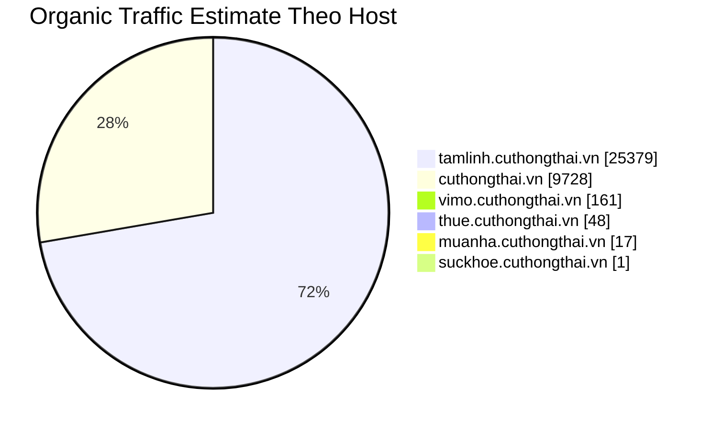
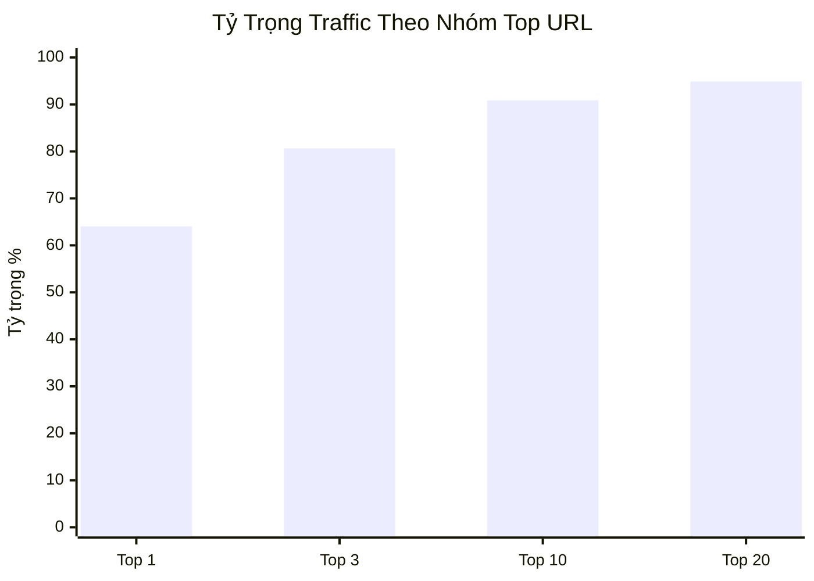
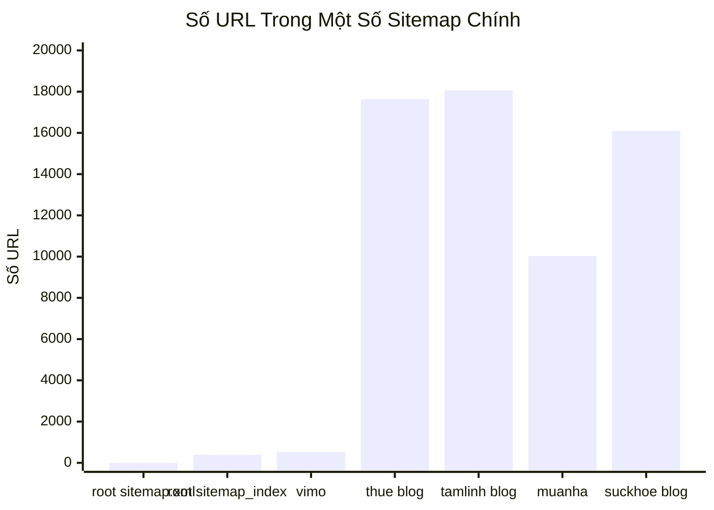
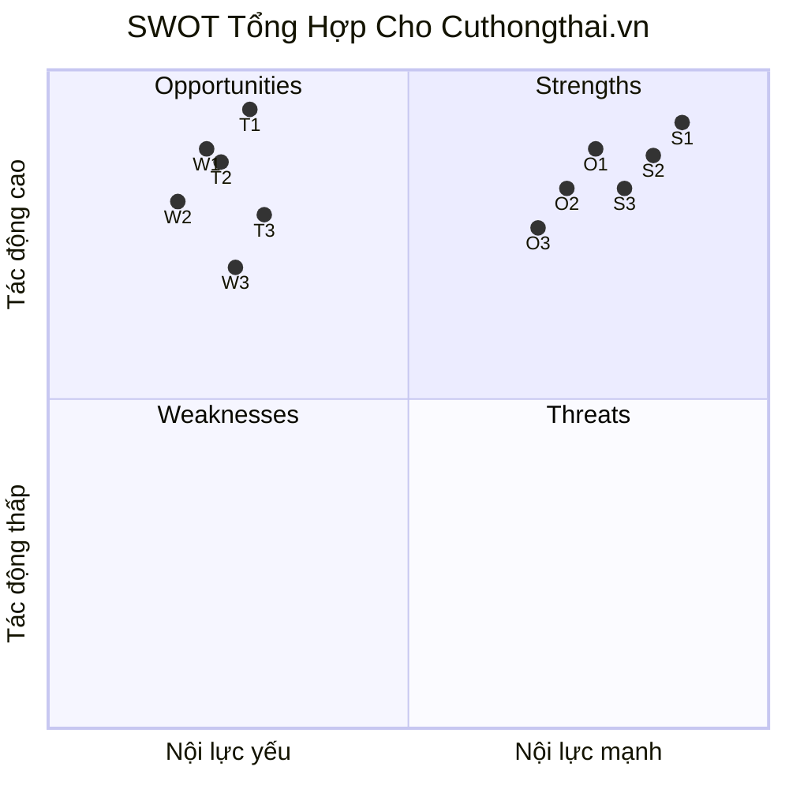
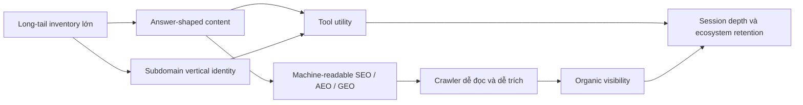

# Nghiên Cứu Tích Hợp Về Cuthongthai.vn

Ngày biên soạn: 2026-06-10  
Đối tượng: `https://cuthongthai.vn/` và các subdomain chính  
Ngôn ngữ: Tiếng Việt  
Mục tiêu: tạo một bản research mới có logic thống nhất, tổng hợp từ nhiều lớp dữ liệu nhưng không ghép cơ học

## 0. Nguồn Dữ Liệu Được Dùng

Bản nghiên cứu này được xây trên các nguồn sau:

- quan sát trực tiếp các host công khai:
  - `https://cuthongthai.vn/`
  - `https://vimo.cuthongthai.vn/`
  - `https://thue.cuthongthai.vn/`
  - `https://tamlinh.cuthongthai.vn/`
  - `https://muanha.cuthongthai.vn/`
  - `https://suckhoe.cuthongthai.vn/`
- review trước đó về `SEO + AI answer engine` ngày `2026-06-07`
- bản đồ funnel subdomain ngày `2026-06-09`
- bản SWOT ngày `2026-06-10`
- file local backlink:
  - `/home/qcweb/cuthongthai.vn-backlinks.csv`
- file local organic pages:
  - `/home/qcweb/https_cuthongthai_vn_organic_PagesV3_vn_20260607_2026_06_08T04_55.csv`
- kiểm tra trực tiếp `robots.txt`, `sitemap.xml`, các sitemap con của root domain và các subdomain ngày `2026-06-10`
- đối chiếu với tài liệu chính thức của Google về:
  - site names
  - Search Console property
  - AI features trong Google Search

## 0.1 Giới Hạn Cần Giữ Trong Đầu Khi Đọc

Bản này là `integrated research`, không phải báo cáo hiệu quả kinh doanh cuối cùng.

Những gì bản này chưa có:

- `GSC Domain Property`
- `GSC URL-prefix` theo từng subdomain
- `GA4` hoặc dữ liệu analytics nội bộ
- dữ liệu conversion thật
- server logs
- bộ backlink đầy đủ từ Ahrefs / Semrush / Majestic

Điều đó có nghĩa là:

- có thể phân tích khá chắc về mô hình, kiến trúc, pattern tăng trưởng và mức độ tập trung traffic
- nhưng không thể kết luận tuyệt đối về hiệu quả thương mại thật của từng vertical

## 1. Tóm Tắt Điều Hành

`Cuthongthai.vn` nổi bật không phải vì “có nhiều subdomain”, mà vì nó đang vận hành như một `multi-vertical search acquisition system` có dáng product.

Nói cách khác:

- đây không phải một site tin tức
- cũng không phải một blog SEO đơn thuần
- cũng không phải một tool site đơn lẻ

Nó là một hệ gồm:

- domain gốc làm `brand hub`
- nhiều subdomain đóng vai trò `vertical product` hoặc `intent silo`
- content long-tail để kéo demand
- tool/module để giữ người dùng trong hệ

Điểm khác biệt lớn nhất so với phần lớn site trên thị trường Việt Nam là:

- họ kết hợp `content scale`, `tool utility`, `machine-readable SEO`, và `subdomain branding` trong cùng một mô hình

Nhưng khi đi sâu vào dữ liệu hiện có, bức tranh không đồng đều:

- organic growth hiện tại không phản ánh sức mạnh cân bằng của toàn hệ
- nó đang tập trung áp đảo vào cụm `tâm linh / tarot / tử vi`
- trong khi nhiều vertical còn lại có inventory URL lớn nhưng chưa thể hiện traction organic tương xứng trong file local đang có

Vì vậy, nếu chỉ nói một câu trung tính nhất:

`Cuthongthai.vn` là một hệ product-led SEO khá khác thường và khá hợp với máy đọc, nhưng tăng trưởng organic nhìn thấy hiện tại chủ yếu đang được kéo bởi một cluster tâm linh rất mạnh chứ chưa phải bởi toàn bộ ecosystem cùng thắng.

## 2. Khung Luận Điểm Của Bản Research

Thay vì ép case này thành một kết luận duy nhất, bản này dùng `6 luận điểm trục`:

1. `Cuthongthai` là loại site gì.
2. Họ khác phần lớn site khác ở đâu.
3. Vì sao mô hình này có thể tăng nhanh.
4. Vai trò thật của subdomain trong hệ này là gì.
5. Traffic hiện tại đang đến từ đâu.
6. Điều gì hiện chưa được dữ liệu ủng hộ.

## 3. Luận Điểm 1: Đây Là Một Hệ Nhiều Vertical Có Dáng Product, Không Phải Một Website Nội Dung Thông Thường

Quan sát tổng thể cho thấy `cuthongthai.vn` không được tổ chức như mô hình phổ biến:

- một domain
- vài category
- blog để lấy traffic

Thay vào đó, nó được tổ chức như:

- `cuthongthai.vn`: thương hiệu mẹ, lớp điều hướng
- `vimo.cuthongthai.vn`: tài chính, vĩ mô, dashboard, community
- `thue.cuthongthai.vn`: thuế, nghĩa vụ tài chính, calculator, guide
- `tamlinh.cuthongthai.vn`: tử vi, văn khấn, phong thủy, công cụ nghi lễ
- `muanha.cuthongthai.vn`: affordability, ROI, quy hoạch, giá đất
- `suckhoe.cuthongthai.vn`: health/lifestyle content và tool

Điểm đáng chú ý là các subdomain này không chỉ là nơi chứa bài viết. Một số phần, đặc biệt là `vimo`, có cảm giác rất gần với `product surface`:

- navigation kiểu app
- module riêng
- community
- terms of use riêng
- cấu trúc điều hướng không giống blog thuần

Kết luận của luận điểm này:

- `Cuthongthai` nên được đọc như một `ecosystem of mini-products`
- không nên đọc nó như một publisher truyền thống

## 4. Luận Điểm 2: Thứ Làm Họ Khác Biệt Là Sự Kết Hợp Giữa Machine-Readable SEO Và Product Funnel

Review ngày `2026-06-07` cho thấy một số dấu hiệu khá khác thường nếu so với mặt bằng site nội dung thông thường:

- article HTML được render sẵn
- có block tóm tắt phục vụ máy đọc như `data-ai-summary`
- structured data dày
- FAQ và answer-shaped sections lặp lại có hệ thống
- source section được cài vào bài
- tool pages không đứng riêng mà được nối vào content
- robots mở cho nhiều AI/search crawlers

Điểm quan trọng ở đây không phải từng kỹ thuật đơn lẻ.

Điểm quan trọng là chúng xuất hiện cùng lúc trong một hệ thống có:

- long-tail content
- tool pages
- subdomain vertical
- luồng điều hướng chéo giữa các phần

Điều này tạo ra một kiểu hiện diện khá hiếm:

- với người dùng, nó giống một hệ nhiều công cụ
- với crawler, nó giống một kho nội dung và utility pages rất dễ đọc

Theo tài liệu chính thức của Google, AI features trong Search không đòi hỏi một lớp markup đặc biệt riêng để được xuất hiện; các nền tảng vẫn dựa trên các nguyên tắc SEO cơ bản như crawlability, textual content, internal links, page experience, structured data khớp với nội dung hiển thị và eligibility trong Search. Nói cách khác, lớp `AI-friendly` ở đây đáng chú ý không phải vì nó tạo ra ngoại lệ với Google, mà vì nó làm tốt những thứ máy đọc cần để hiểu trang. Nguồn chính thức:

- `AI features and your website`: `https://developers.google.com/search/docs/appearance/ai-features`
- `Site Names in Google Search`: `https://developers.google.com/search/docs/appearance/site-names`
- `Add a website property to Search Console`: `https://support.google.com/webmasters/answer/34592`

Kết luận của luận điểm này:

- họ không chỉ tối ưu cho ranking
- họ còn tối ưu cho việc nội dung được `đọc`, `trích`, `tóm`, và `đặt vào ngữ cảnh trả lời`

## 5. Luận Điểm 3: Mô Hình Này Có Thể Tăng Nhanh Vì Nó Ghép Được 4 Động Cơ Với Nhau

### 5.1 Động cơ 1: Long-tail inventory lớn

Các sitemap và pattern URL cho thấy hệ này không đi theo logic “ít trang nhưng chất lượng cao tuyệt đối”.

Nó đi theo logic:

- phủ rất rộng
- mở nhiều variation query
- dùng template hoặc semi-programmatic structures để mở inventory

Ví dụ từ các sitemap kiểm tra trực tiếp:

- `vimo.cuthongthai.vn/sitemap-vimo.xml`: `521 URL`
- `thue.cuthongthai.vn/sitemap-thue.xml`: `51 URL`
- `thue.cuthongthai.vn/sitemap-blog-thue.xml`: `17,641 URL`
- `tamlinh.cuthongthai.vn/sitemap-tamlinh.xml`: `661 URL`
- `tamlinh.cuthongthai.vn/sitemap-blog-tamlinh.xml`: `18,059 URL`
- `muanha.cuthongthai.vn/sitemap-muanha.xml`: `10,034 URL`
- `suckhoe.cuthongthai.vn/sitemap.xml`: `10,042 URL`
- `suckhoe.cuthongthai.vn/sitemap-blog-suckhoe.xml`: `16,094 URL`

Chỉ riêng quy mô inventory này đã khác phần lớn site Việt Nam vốn hoặc:

- chỉ có blog
- hoặc chỉ có product pages
- hoặc có tool nhưng rất ít content đi kèm

### 5.2 Động cơ 2: Nội dung được đóng gói theo dạng dễ match query

Review cũ ghi nhận nhiều title formula và content format mang tính `answer candidate` rất rõ:

- số bước
- mốc năm
- persona cụ thể
- risk framing
- FAQ
- nguồn tham khảo

Đây là kiểu đóng gói dễ:

- match long-tail
- match natural-language search
- và dễ được hệ thống AI hiểu là một đoạn trả lời có cấu trúc

### 5.3 Động cơ 3: Content không đứng một mình mà đẩy sang tool

Điểm này rất quan trọng.

Nhiều site SEO mạnh ở phần `content acquisition`, nhưng không có nơi để dẫn người dùng đi tiếp ngoài các bài viết khác.

`Cuthongthai` thì khác:

- content kéo demand
- tool/module giữ người dùng
- internal links đẩy người dùng sang nơi có utility cao hơn

Điều này làm cho hệ không chỉ là “nhiều trang được index”, mà là một cấu trúc có `next step` khá rõ.

### 5.4 Động cơ 4: Mỗi vertical có site identity riêng

Google không nói subdomain tự động tốt hơn subfolder.

Nhưng Google có một số cơ chế và tín hiệu được áp ở cấp site/subdomain, ví dụ:

- site names
- Search Console property
- theo dõi hiệu năng ở từng host riêng

Điều này làm cho subdomain trở thành một đơn vị có thể được cảm nhận như một site riêng nếu nó đủ độc lập về nội dung, điều hướng và branding.

Trong case này, các vertical được dựng như những thực thể khá riêng biệt:

- `Vimo` mang dáng app tài chính
- `Thuế` mang dáng tax co-pilot
- `Tamlinh` mang dáng thư viện nghi lễ và tool tâm linh
- `Muanha` mang dáng công cụ ra quyết định bất động sản

Kết luận của luận điểm này:

- tốc độ tăng trưởng tiềm năng của hệ này đến từ việc nó ghép được `inventory + answer packaging + tools + site identity`
- không phải từ một mẹo kỹ thuật đơn lẻ

## 6. Luận Điểm 4: Subdomain Ở Đây Là Quyết Định Về Product, UX Và Intent Silo Nhiều Hơn Là Mẹo SEO

Nếu chỉ nhìn hời hợt, có thể nghĩ họ tách subdomain vì “muốn SEO tốt hơn”.

Nhưng khi ghép dữ liệu funnel và UX lại, cách đọc hợp lý hơn là:

- subdomain giúp tạo `environment` riêng cho từng vấn đề
- người dùng đi trong một ngữ cảnh chủ đề sạch hơn
- CTA sang tool nhìn tự nhiên hơn
- navigation và brand layer của từng vertical rõ hơn

Ví dụ:

- người đang ở `thue` không bị trộn điều hướng của `tamlinh`
- người ở `muanha` có thể đi từ bài viết sang affordability, ROI, trả góp trong cùng một ngữ cảnh
- `vimo` trông như một bề mặt sản phẩm riêng, không như thư mục con của một blog

Điều này cũng phù hợp với cách Google định nghĩa các property trong Search Console:

- domain property cho bức tranh toàn hệ
- URL-prefix property cho từng subdomain nếu cần đọc riêng

Nói cách khác:

- subdomain ở đây không chỉ là cách chia URL
- nó là cách chia `funnel`, `site identity`, `measurement surface`, và `intent silo`

Tuy nhiên, mặt còn lại của chính quyết định này là:

- authority không tự hội tụ dễ như mô hình subfolder thống nhất
- từng vertical phải tự chứng minh sức mạnh của mình rõ hơn

## 7. Luận Điểm 5: Organic Performance Hiện Tại Đang Tập Trung Cực Mạnh Vào Cụm Tâm Linh, Không Phải Toàn Hệ Cùng Mạnh

Đây là phần quan trọng nhất mà bản review cũ chưa có.

Từ file local `/home/qcweb/https_cuthongthai_vn_organic_PagesV3_vn_20260607_2026_06_08T04_55.csv`:

- `1,000` URL trong export
- tổng estimated traffic: `35,334`

Phân bổ theo host:

| Host | Traffic estimate | Tỷ trọng |
| --- | ---: | ---: |
| `tamlinh.cuthongthai.vn` | `25,379` | `71.83%` |
| `cuthongthai.vn` | `9,728` | `27.53%` |
| `vimo.cuthongthai.vn` | `161` | `0.46%` |
| `thue.cuthongthai.vn` | `48` | `0.14%` |
| `muanha.cuthongthai.vn` | `17` | `0.05%` |
| `suckhoe.cuthongthai.vn` | `1` | `0.00%` |

Top pages:

| URL | Traffic estimate |
| --- | ---: |
| `https://tamlinh.cuthongthai.vn/tu-vi` | `22,633` |
| `https://cuthongthai.vn/boi-tarot-tinh-yeu/` | `3,913` |
| `https://tamlinh.cuthongthai.vn/boi/tarot` | `1,946` |

Mức độ tập trung:

- top `1` URL chiếm `64.05%`
- top `3` URL chiếm `80.64%`
- top `10` URL chiếm `90.87%`
- top `20` URL chiếm `94.87%`

Phân bổ theo intent:

- `Informational`: `99.28%`

Phân bổ theo cụm vertical thực tế:

- `tamlinh-related`: `31,824`, tương đương `90.07%`
- `other-root-content`: `3,309`, tương đương `9.36%`
- `finance-related`: `112`
- `tax-related`: `65`
- `real-estate-related`: `23`
- `health-related`: `1`

Điều này thay đổi hoàn toàn cách đọc site này.

Nếu chỉ nhìn kiến trúc, người ta có thể nghĩ:

- đây là một ecosystem đa ngành đang tăng trưởng rộng khắp

Nhưng nếu nhìn dữ liệu organic pages hiện có, cách mô tả đúng hơn là:

- đây là một ecosystem nhiều vertical
- nhưng sức kéo organic hiện tại chủ yếu đến từ `tâm linh / tarot / tử vi`

Kết luận của luận điểm này:

- cấu trúc toàn hệ là đa vertical
- nhưng performance hiện tại lại là `single dominant cluster`

## 8. Luận Điểm 6: Backlink Và Root Sitemap Hiện Không Phải Lời Giải Thích Chính Cho Tăng Trưởng Nhìn Thấy

### 8.1 Backlink có tồn tại, nhưng chưa cho thấy sức mạnh off-page áp đảo

Từ file local backlink:

- `5,091` backlink rows
- `1,022` source hosts
- `2,145` target URLs
- `3,868` dofollow
- `1,223` nofollow

Nhưng profile bị méo khá mạnh:

- `1` row ở `Page ascore 40-59`
- `19` row ở `20-39`
- `5,071` row ở `0-19`

Các nguồn lớn nhất còn bị tập trung bất thường:

- `bepos.io`: `1,945`
- `sstock.com.vn`: `1,295`

Phân bổ target host:

- `cuthongthai.vn`: `4,665`
- `tamlinh.cuthongthai.vn`: `350`
- `vimo.cuthongthai.vn`: `66`
- `suckhoe.cuthongthai.vn`: `6`
- `thue.cuthongthai.vn`: `4`

Diễn giải hợp lý nhất:

- domain không phải zero-backlink
- nhưng hồ sơ off-page nhìn chưa giống một lợi thế cạnh tranh quá mạnh
- ít nhất với dữ liệu đang có, backlink chưa phải lời giải thích chính cho đà tăng trưởng organic được quan sát

### 8.2 Lớp sitemap hiện rất phân mảnh

Kiểm tra trực tiếp ngày `2026-06-10` cho thấy một cấu trúc sitemap rất không đồng đều:

- `https://cuthongthai.vn/robots.txt` chỉ công bố `https://cuthongthai.vn/sitemap.xml`
- nhưng `https://cuthongthai.vn/sitemap.xml` hiện chỉ có `2 URL`:
  - `https://thue.cuthongthai.vn`
  - `https://thue.cuthongthai.vn/blog`
- trong khi `https://cuthongthai.vn/sitemap_index.xml` lại tồn tại riêng và có `393` mục `<loc>`
- `sitemap_index.xml` của root không thấy liệt kê các subdomain chính

Các subdomain thì công bố sitemap theo những logic khác nhau:

- `vimo` dùng `sitemap-vimo.xml`
- `thue` dùng `sitemap-thue.xml` và `sitemap-blog-thue.xml`
- `tamlinh` dùng `sitemap-tamlinh.xml` và `sitemap-blog-tamlinh.xml`
- `muanha` dùng `sitemap-muanha.xml`
- `suckhoe` dùng `sitemap.xml` và `sitemap-blog-suckhoe.xml`

Điều dữ liệu này nói lên:

- không có một lớp sitemap hợp nhất phản ánh toàn bộ ecosystem
- discovery của từng vertical nhiều khả năng dựa vào sitemap riêng của từng host hơn là vào root
- root hiện chưa hoạt động như một `SEO hub` gọn và tập trung cho cả hệ

### 8.3 Một bằng chứng cũ nhưng đáng chú ý: vấn đề hygiene trong sitemap lớn

Review ngày `2026-06-07` ghi nhận ở `thue`:

- `sitemap-blog-thue.xml` khi đó khoảng `16,009 URLs`
- một mixed sample ghi nhận `31 URL 200` và `30 URL 404`

Tôi không dùng con số này như kết luận thời điểm hiện tại, vì snapshot đã khác ngày.

Nhưng nó vẫn là một tín hiệu phân tích quan trọng:

- khi một hệ mở inventory rất lớn, chất lượng sitemap và trạng thái URL trở thành biến số rất quan trọng

Kết luận của luận điểm này:

- với bộ dữ liệu đang có, tăng trưởng không được giải thích tốt nhất bằng `backlink strength`
- cũng không được giải thích tốt nhất bằng một `root sitemap architecture` sạch và thống nhất
- lời giải hợp lý hơn nằm ở `inventory + answer packaging + intent fit + tool funnel`

## 9. Kết Hợp 6 Luận Điểm Lại Thì Bức Tranh Hoàn Chỉnh Là Gì

Nếu ghép toàn bộ các lớp bằng chứng lại, cách mô tả chính xác nhất về `cuthongthai.vn` là:

### 9.1 Ở tầng mô hình

Đây là một `house of search-led products`:

- domain gốc là brand umbrella
- subdomain là product/intent surface
- content dùng để kéo demand
- tool dùng để giữ và mở rộng hành trình

### 9.2 Ở tầng SEO/AEO/GEO mechanics

Họ đang làm nhiều thứ khá hợp với cách crawler và answer engines đọc web:

- HTML render sẵn
- content có cấu trúc trả lời
- schema dày
- source section
- tool-linked content
- robots khá mở cho search/AI

### 9.3 Ở tầng performance hiện tại

Hệ này chưa cho thấy organic strength cân bằng trên mọi vertical.

Nó đang giống:

- một `spiritual traffic engine`
- gắn lên trên một `multi-vertical product ecosystem`

### 9.4 Ở tầng lý giải tăng trưởng

Nếu phải chọn lời giải thích hợp lý nhất cho việc traffic có thể tăng mạnh trong thời gian ngắn, thì đó nhiều khả năng là:

- mở inventory rất lớn
- chọn đúng cụm query có demand
- đóng gói nội dung theo dạng dễ match query và dễ cho máy đọc
- nối nội dung với tool
- dùng subdomain để tạo site identity riêng cho từng vertical

Không có dấu hiệu đủ mạnh để nói rằng:

- backlink là động cơ chính
- hay root architecture sạch đẹp là động cơ chính

## 10. SWOT Tổng Hợp Kèm Graphs

Phần này không thay thế 6 luận điểm ở trên. Nó chỉ nén toàn bộ research thành một khung SWOT dễ quét nhanh hơn.

### 10.1 Ma Trận SWOT Một Trang

| Nhóm | Nội dung cô đọng nhất |
| --- | --- |
| `Strengths` | 1. Hệ nhiều vertical có dáng product thật. 2. Machine-readable SEO/AEO/GEO mechanics khá mạnh. 3. Funnel `content -> tool -> ecosystem` rõ. 4. `Tamlinh` đã chứng minh được intent-fit SEO rất mạnh. |
| `Weaknesses` | 1. Authority bị phân mảnh giữa nhiều subdomain. 2. Organic performance hiện lệch nặng về một cluster. 3. Root sitemap không phản ánh toàn hệ một cách tập trung. 4. Off-page hiện chưa cho thấy sức mạnh vượt trội. |
| `Opportunities` | 1. Mỗi vertical có thể được đọc như một product surface riêng. 2. Inventory lớn tạo điều kiện mở rộng query coverage. 3. Tool utility giúp hệ khác blog thuần. 4. Dữ liệu host-level cho phép đọc từng vertical như những hệ tăng trưởng riêng. |
| `Threats` | 1. Phụ thuộc traffic mạnh vào cụm tâm linh. 2. Programmatic scale có thể kéo theo hygiene risk. 3. Vertical rộng gây loãng authority và trust. 4. Nếu một cluster chủ lực suy yếu, toàn hệ có thể biến động mạnh. |

### 10.2 Graph 1: Phân Bổ Organic Traffic Theo Host

Điểm đọc chính từ graph này:

- `tamlinh` đang chiếm phần lớn organic traffic estimate
- root domain đứng thứ hai nhưng kém xa `tamlinh`
- các vertical còn lại hiện rất nhỏ nếu chỉ nhìn theo file organic pages local

### 10.3 Graph 2: Mức Độ Tập Trung Traffic Ở Top URL

Điểm đọc chính:

- traffic không chỉ tập trung vào một vertical
- mà còn tập trung vào một số rất ít URL đầu tàu trong vertical đó

### 10.4 Graph 3: Quy Mô Một Số Sitemap Chính Đang Được Công Bố

Điểm đọc chính:

- root `sitemap.xml` rất nhỏ so với phần còn lại của hệ
- discovery layer thực tế đang nằm nhiều ở các sitemap riêng của subdomain
- kiến trúc sitemap hiện phân mảnh mạnh, không phải một bề mặt tập trung

### 10.5 Graph 4: Bản Đồ SWOT Trên Hai Trục

### 10.5.1 Chú Giải Quadrant

- `S1`: Mô hình `content -> tool -> ecosystem` rõ
- `S2`: Machine-readable SEO/AEO/GEO mechanics mạnh
- `S3`: Mỗi vertical có site identity tương đối riêng
- `W1`: Authority và performance bị phân mảnh giữa các host
- `W2`: Root sitemap và root hub chưa phản ánh toàn hệ theo cách tập trung
- `W3`: Off-page hiện chưa cho thấy sức mạnh đủ lớn để bù fragmentation
- `O1`: Inventory lớn giúp mở rộng query coverage rất nhanh
- `O2`: Product surface theo vertical giúp hệ khác blog/publisher thông thường
- `O3`: Có thể đọc từng vertical như một growth surface riêng
- `T1`: Phụ thuộc mạnh vào cluster tâm linh
- `T2`: Scale lớn kéo theo hygiene risk ở URL và sitemap
- `T3`: Umbrella brand quá rộng có thể làm loãng authority/trust

### 10.6 Flow Map: Cách Hệ Này Tự Tạo Khác Biệt

Flow này tóm tắt logic cốt lõi của case:

- inventory không đứng một mình
- content không đứng một mình
- tool không đứng một mình
- subdomain cũng không phải yếu tố độc lập

Chúng hoạt động như một hệ.

### 10.7 Kết Luận SWOT Rút Gọn

Nếu nén toàn bộ case thành một kết luận SWOT ngắn nhất:

- `điểm mạnh` của `cuthongthai` nằm ở kiến trúc hệ thống và cách đóng gói nội dung cho cả người dùng lẫn máy đọc
- `điểm yếu` nằm ở sự phân mảnh và độ lệch hiệu năng giữa các vertical
- `cơ hội` nằm ở việc mỗi vertical có thể được hiểu như một surface tăng trưởng riêng
- `rủi ro` nằm ở việc hiện tại organic traffic đang bị phụ thuộc quá mạnh vào một cluster tâm linh

## 11. Những Điều Nghiên Cứu Hiện Tại Chưa Chứng Minh Được

Các dữ liệu hiện có chưa đủ để kết luận chắc các điểm sau:

- vertical nào mang lại conversion hoặc revenue cao nhất
- `vimo` có thể traffic thấp hơn nhưng business value cao hơn hay không
- các subdomain yếu organic hiện nay có đang mạnh ở kênh khác không
- mức độ cannibalization thật giữa root và subdomain
- chất lượng click từ các cụm `tamlinh` có chuyển sang usage hay không

Điều này rất quan trọng vì:

- research hiện tại đọc rất rõ `search structure`
- nhưng chưa thể đọc trọn `business outcome`

## 12. Kết Luận Cuối Cùng

`Cuthongthai.vn` nổi bật và khác biệt nhất so với nhiều site khác trên thị trường ở chỗ nó không vận hành như một site nội dung thuần, mà như một hệ nhiều mini-product được tăng trưởng bằng search. Họ kết hợp được inventory lớn, answer-oriented content, tool utility, subdomain branding và machine-readable SEO trong cùng một mô hình.`

`Nhưng lớp dữ liệu traffic hiện có cho thấy sức mạnh organic hiện tại chưa phân bổ đều trên toàn hệ. Nó đang tập trung rất mạnh vào cụm tâm linh, đặc biệt là một số URL đầu tàu. Vì vậy, nếu đọc site này cho đúng, phải giữ cùng lúc hai ý: đây là một kiến trúc ecosystem khá khác thường và khá tinh vi, nhưng performance organic đang phản ánh một cluster thắng rất mạnh nhiều hơn là sự trưởng thành đồng đều của toàn bộ hệ.`

## 13. File Liên Quan Để So Sánh

- review cũ: `https://github.com/ThanaLamth/rewrite-and-improve/blob/main/2026-06-07-cuthongthai-seo-ai-answer-review.md`
- funnel map: `https://github.com/ThanaLamth/rewrite-and-improve/blob/main/cuthongthai_subdomain_funnel_map_2026-06-09.vi.md`
- SWOT: `https://github.com/ThanaLamth/rewrite-and-improve/blob/main/cuthongthai_swot_analysis_2026-06-10.vi.md`
