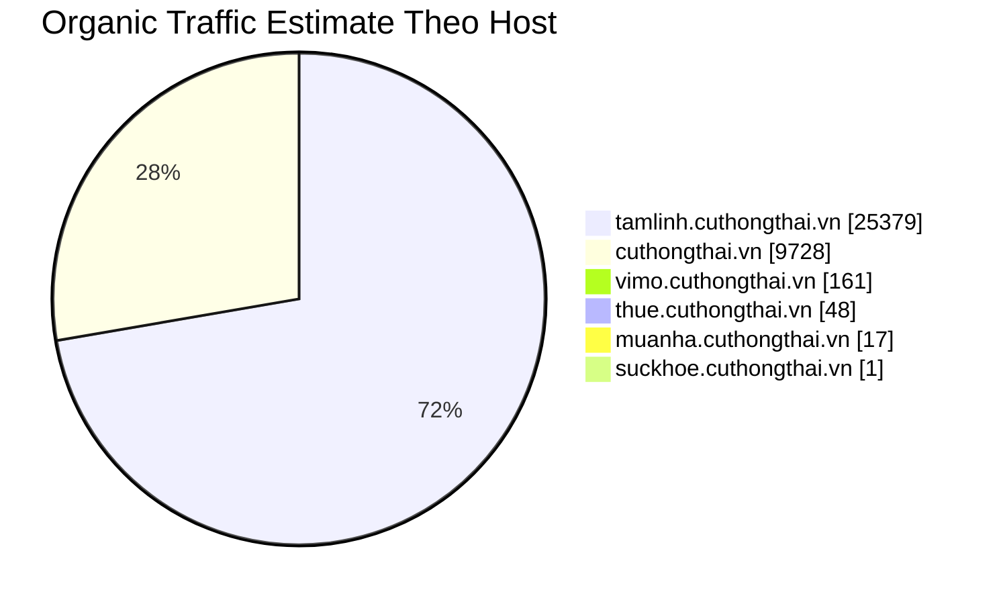
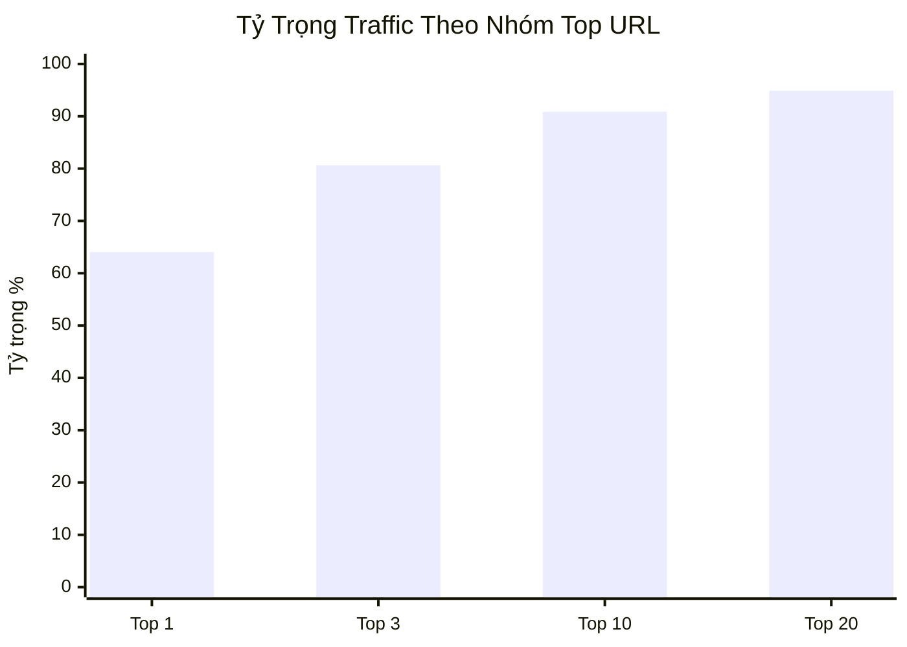
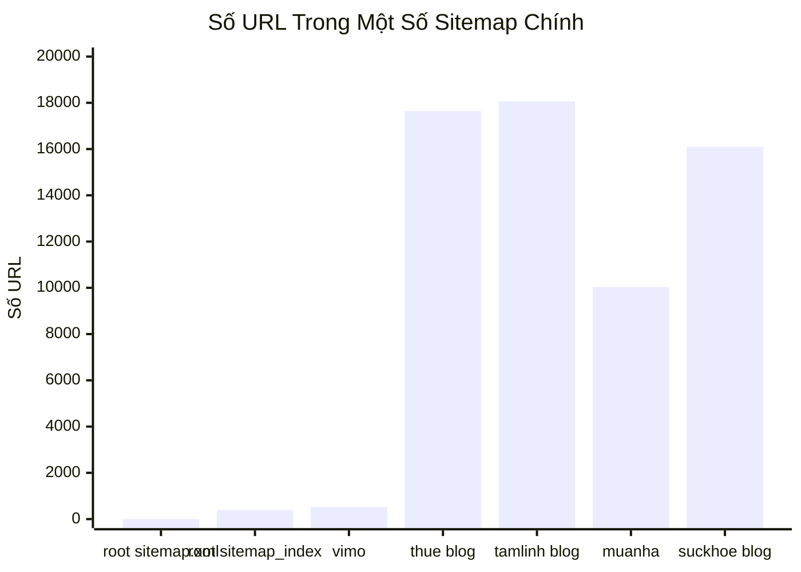
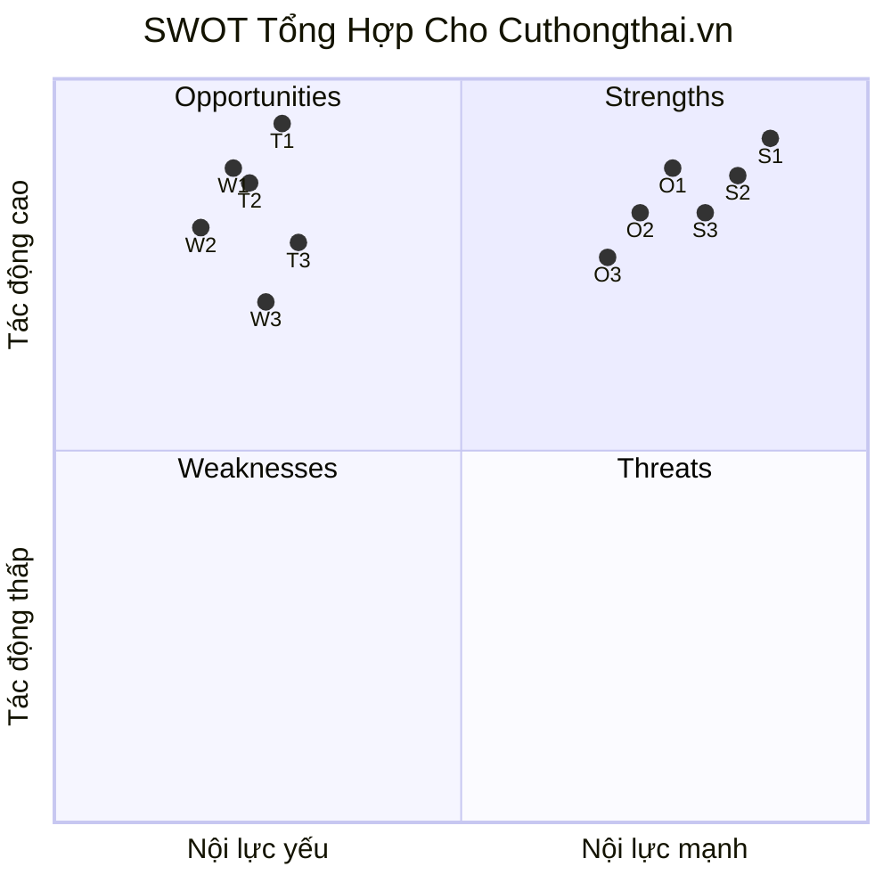

# Cuthongthai.vn: Executive Summary

Ngày biên soạn: 2026-06-10  
Nguồn gốc: rút gọn từ bản research tích hợp đầy đủ  
Mục tiêu: bản đọc nhanh kiểu slide, tập trung vào các ý lớn và graphs

## Slide 1: Cuthongthai Là Gì

`Cuthongthai.vn` không vận hành như một site nội dung thông thường.

Nó giống một `multi-vertical search ecosystem`:

- `cuthongthai.vn` là brand hub
- `vimo`, `thue`, `tamlinh`, `muanha`, `suckhoe` là các vertical riêng
- content kéo demand
- tool/module giữ người dùng trong hệ

Điểm khác biệt lớn nhất:

- kết hợp `content scale`
- `tool utility`
- `machine-readable SEO`
- `subdomain branding`

## Slide 2: Điều Gì Làm Họ Khác Site Khác

Họ không chỉ làm SEO kiểu bài viết để lấy traffic.

Họ đang ghép 4 lớp với nhau:

1. inventory URL rất lớn
2. content đóng gói theo dạng dễ match query và dễ cho máy đọc
3. tool utility tạo bước đi tiếp sau content
4. mỗi vertical có site identity riêng

## Slide 3: Vì Sao Máy Đọc Dễ Hiểu Hệ Này

Review cũ cho thấy:

- HTML render sẵn
- answer-shaped content
- FAQ
- schema dày
- source section
- robots khá mở cho search/AI crawlers

Điểm đáng chú ý:

- đây không phải một mẹo đơn lẻ
- nó là một pattern xuất hiện xuyên suốt trong hệ

## Slide 4: Subdomain Ở Đây Không Chỉ Là Chia URL

Trong case này, subdomain mang vai trò:

- product surface
- intent silo
- UX environment
- measurement surface

Tức là:

- `thue` là môi trường thuế
- `tamlinh` là môi trường tâm linh
- `vimo` là môi trường tài chính kiểu app

## Slide 5: Traffic Đang Đến Từ Đâu

Từ file organic pages local:

- tổng estimated traffic: `35,334`
- `tamlinh.cuthongthai.vn`: `25,379` tương đương `71.83%`
- `cuthongthai.vn`: `9,728` tương đương `27.53%`
- các host còn lại cộng lại chưa tới `1%`

## Slide 6: Traffic Tập Trung Mạnh Tới Mức Nào

- top `1` URL chiếm `64.05%`
- top `3` URL chiếm `80.64%`
- top `10` URL chiếm `90.87%`
- top `20` URL chiếm `94.87%`

Ý chính:

- organic performance hiện tại không cân bằng
- nó đang bị kéo rất mạnh bởi một số URL đầu tàu trong cluster `tâm linh`

## Slide 7: Sitemap Và Quy Mô Hệ

Một số sitemap chính đang public:

- root `sitemap.xml`: `2 URL`
- root `sitemap_index.xml`: `393`
- `vimo`: `521`
- `thue blog`: `17,641`
- `tamlinh blog`: `18,059`
- `muanha`: `10,034`
- `suckhoe blog`: `16,094`

Ý chính:

- root không phản ánh toàn hệ theo một lớp sitemap tập trung
- sitemap discovery đang phân mảnh theo từng host

## Slide 8: Backlink Có Phải Động Cơ Chính Không

Từ file backlink local:

- có backlink
- nhưng quality profile nhìn chưa mạnh
- dữ liệu bị lệch bởi vài source host lớn
- `Page ascore` chủ yếu ở nhóm thấp

Kết luận ở mức phân tích:

- backlink hiện chưa phải lời giải thích chính cho tăng trưởng đang thấy

## Slide 9: SWOT Một Trang

| Nhóm | Ý chính |
| --- | --- |
| `Strengths` | product-like ecosystem, machine-readable SEO mạnh, funnel `content -> tool`, `tamlinh` có intent-fit rất mạnh |
| `Weaknesses` | authority phân mảnh, traffic lệch nặng, root sitemap yếu, off-page chưa nổi bật |
| `Opportunities` | inventory lớn, mỗi vertical là một growth surface riêng, tool utility khác blog thuần |
| `Threats` | phụ thuộc mạnh vào cluster tâm linh, hygiene risk khi scale lớn, umbrella brand quá rộng |

## Slide 10: Câu Kết Một Dòng

`Cuthongthai.vn` là một hệ nhiều mini-product tăng trưởng bằng search, rất khác thường ở cách ghép content, tool, subdomain và machine-readable SEO; nhưng organic performance hiện tại đang phản ánh sức mạnh áp đảo của cluster tâm linh nhiều hơn là sức mạnh cân bằng của toàn bộ hệ.

## Link Bản Đầy Đủ

- research đầy đủ: `https://github.com/ThanaLamth/rewrite-and-improve/blob/main/cuthongthai_integrated_research_2026-06-10.vi.md`
- SWOT đầy đủ trong research: cùng file ở trên
