# Cuthongthai.vn: Master Graph

Ngày biên soạn: 2026-06-11  
Mục tiêu: một graph tổng hợp duy nhất để nhìn nhanh toàn bộ case

```mermaid
flowchart TD
    A["Cuthongthai.vn<br/>Multi-vertical search ecosystem"]

    A --> B["Kiến trúc hệ"]
    A --> C["Động cơ tăng trưởng"]
    A --> D["Reality của traffic"]
    A --> E["Điểm hạn chế hiện tại"]

    B --> B1["Root domain = brand hub"]
    B --> B2["Subdomain = vertical product / intent silo"]
    B --> B3["Content -> Tool -> Ecosystem"]
    B --> B4["Vimo / Thue / Tamlinh / Muanha / Suckhoe"]

    C --> C1["Inventory URL lớn"]
    C --> C2["Answer-shaped content"]
    C --> C3["Machine-readable SEO / AEO / GEO"]
    C --> C4["Tool utility và internal path rõ"]
    C --> C5["Mỗi vertical có site identity riêng"]

    D --> D1["Organic estimate: 35,334"]
    D --> D2["tamlinh.cuthongthai.vn = 71.83%"]
    D --> D3["Tamlinh-related cluster = 90.07%"]
    D --> D4["Top 1 URL = 64.05%"]
    D --> D5["Intent informational = 99.28%"]

    E --> E1["Authority bị phân mảnh giữa nhiều host"]
    E --> E2["Backlink có nhưng chưa cho thấy sức mạnh áp đảo"]
    E --> E3["Root sitemap.xml chỉ phản ánh rất nhỏ toàn hệ"]
    E --> E4["Sitemap discovery đang phân mảnh theo subdomain"]
    E --> E5["Performance hiện chưa cân bằng giữa các vertical"]

    D2 --> F["Kết luận trung tâm"]
    D3 --> F
    C1 --> F
    C4 --> F
    E1 --> F

    F["Đây là một ecosystem khá tinh vi về cấu trúc và machine-readable SEO,<br/>nhưng organic performance hiện tại đang được kéo chủ yếu bởi cluster tâm linh,<br/>không phải bởi toàn bộ hệ cùng mạnh như nhau."]
```

## Cách Đọc Graph

- Nhánh `Kiến trúc hệ` trả lời: site này thực chất là loại mô hình gì.
- Nhánh `Động cơ tăng trưởng` trả lời: vì sao hệ này có thể mở rộng organic visibility nhanh.
- Nhánh `Reality của traffic` trả lời: traffic hiện tại đang đến từ đâu.
- Nhánh `Điểm hạn chế hiện tại` trả lời: điều gì làm bức tranh chưa cân bằng.
- Node `Kết luận trung tâm` là phần rút gọn nhất của toàn bộ research.

## Link Liên Quan

- research đầy đủ: `https://github.com/ThanaLamth/rewrite-and-improve/blob/main/cuthongthai_integrated_research_2026-06-10.vi.md`
- summary dạng slide: `https://github.com/ThanaLamth/rewrite-and-improve/blob/main/cuthongthai_integrated_research_summary_2026-06-10.vi.md`
