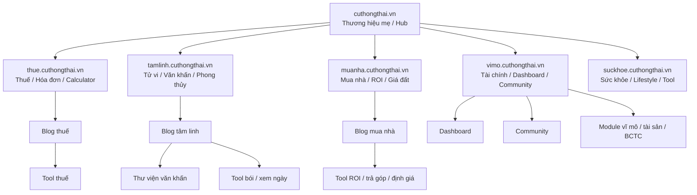
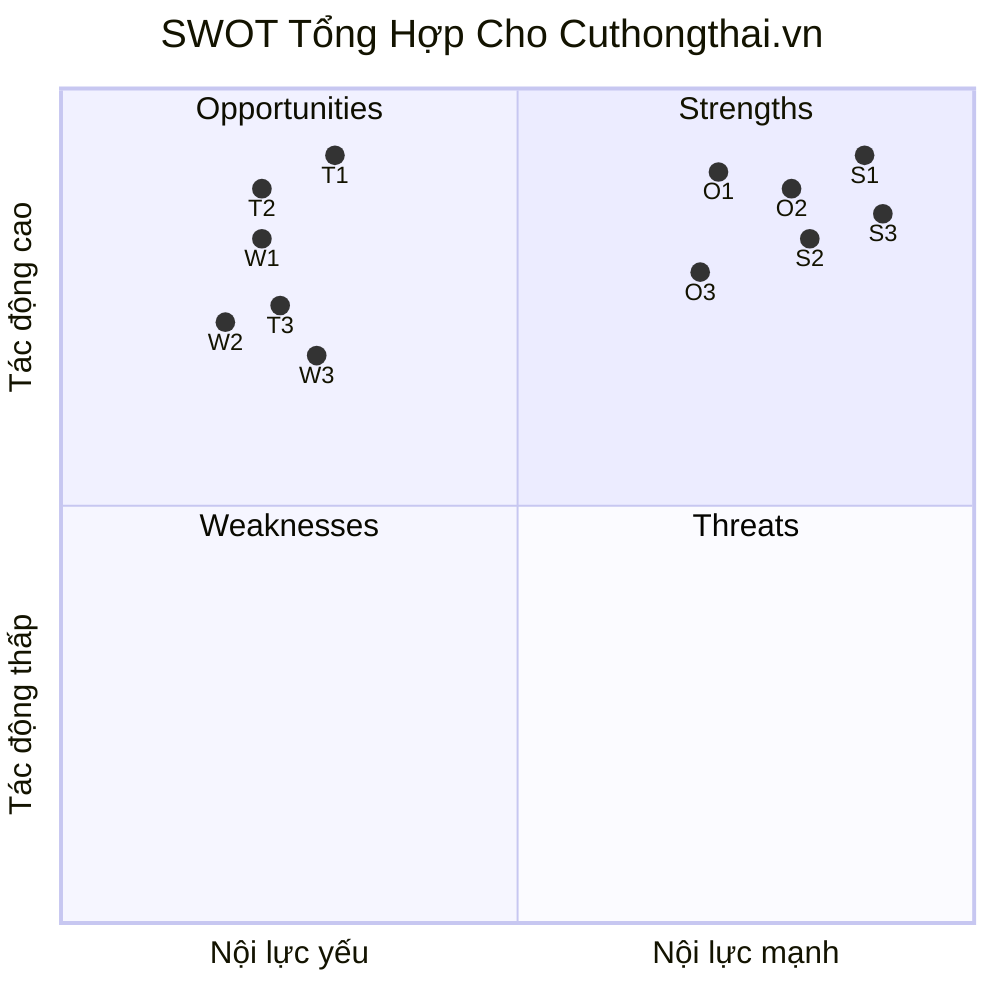
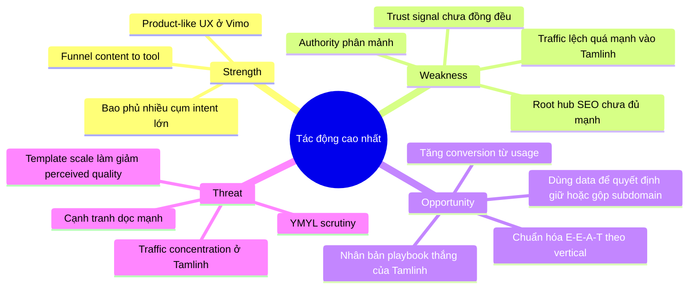

# Phân Tích SWOT Toàn Diện Cho Cuthongthai.vn

Ngày phân tích: 2026-06-10  
Đối tượng: `https://cuthongthai.vn/` và các subdomain chính  
Ngôn ngữ: Tiếng Việt  
Định dạng: Markdown dùng được trực tiếp trên GitHub

## 0. Phạm Vi, Phương Pháp Và Giới Hạn

### 0.1 Phạm vi đánh giá

Phân tích này tập trung vào:

- `https://cuthongthai.vn/`
- các subdomain chính đang hiển thị công khai
- homepage, blog, tool hub, canonical, sitemap và mô hình điều hướng giữa các vertical

### 0.2 Phương pháp dùng để đánh giá

Phân tích được xây trên 4 lớp:

1. quan sát trực tiếp trang đích, title, description, canonical và điều hướng
2. kiểm tra sitemap và quy mô URL ở từng subdomain
3. kiểm tra mẫu content và luồng `content -> tool -> ecosystem`
4. đối chiếu với nguyên tắc chính thức của Google về site-level signals, Search Console property và AI/search guidance

### 0.3 Những gì chưa có trong bản này

Bản SWOT này **chưa** có các dữ liệu nội bộ sau:

- GSC Domain Property
- GSC URL-prefix theo từng subdomain
- dữ liệu click sang tool
- dữ liệu conversion thật
- dữ liệu retention hoặc revenue
- dữ liệu backlink đầy đủ từ Ahrefs, Semrush, Majestic hoặc GSC Links export

Vì vậy, đây là một bản `strategic assessment` rất mạnh ở tầng kiến trúc, nhưng chưa phải `final business verdict`.

### 0.4 Hệ quả của giới hạn dữ liệu

Điều này có nghĩa là:

- có thể chốt được logic mô hình
- có thể chốt được điểm mạnh, điểm yếu và rủi ro
- nhưng chưa thể chốt tuyệt đối subdomain nào nên giữ hay gộp nếu thiếu dữ liệu hiệu quả thực tế

## 1. Tóm Tắt Điều Hành

`Cuthongthai.vn` không vận hành như một website nội dung đơn lẻ. Nó giống một `hệ sinh thái nhiều sản phẩm` hơn, trong đó domain gốc đóng vai trò thương hiệu mẹ và bộ điều hướng, còn các subdomain đóng vai trò những `vertical product` hoặc `intent silo` riêng.

Điểm nổi bật nhất của mô hình này là:

- phủ được nhiều cụm intent lớn
- nối được `content -> tool -> ecosystem`
- có tiềm năng chuyển traffic thành usage hoặc chuyển đổi tốt hơn mô hình blog truyền thống

Điểm rủi ro lớn nhất là:

- authority bị phân mảnh giữa nhiều subdomain
- tín hiệu kỹ thuật và trust signal chưa đồng đều
- phạm vi chủ đề quá rộng, đặc biệt ở các mảng nhạy cảm như thuế, tài chính, sức khỏe

Đặc biệt, từ dữ liệu backlink local hiện có, tăng trưởng của site này **có vẻ không được dẫn bởi sức mạnh off-page**, mà chủ yếu đến từ:

- độ phủ content
- quy mô inventory URL
- mô hình `content -> tool`
- internal architecture
- khả năng khớp intent tìm kiếm

Tuy nhiên, từ file organic pages local mới kiểm tra, cần bổ sung một kết luận rất quan trọng:

- tăng trưởng organic hiện tại **không phân bổ đều trên toàn hệ**
- traffic đang tập trung áp đảo vào cụm `tâm linh / tarot / tử vi`
- nghĩa là ở trạng thái hiện tại, site này vận hành giống một `spiritual search engine kéo cả ecosystem` hơn là một hệ đa vertical đang cùng thắng

## 2. Snapshot Hiện Trạng

### 2.1 Các vertical chính quan sát được

- `cuthongthai.vn`: thương hiệu mẹ, trang điều hướng hệ sinh thái
- `vimo.cuthongthai.vn`: tài chính, vĩ mô, dashboard, community
- `thue.cuthongthai.vn`: thuế, hóa đơn, công cụ xử lý nghĩa vụ tài chính
- `tamlinh.cuthongthai.vn`: tử vi, phong thủy, văn khấn, bói toán
- `muanha.cuthongthai.vn`: mua nhà, ROI, khả năng mua, pháp lý, định giá
- `suckhoe.cuthongthai.vn`: sức khỏe, lối sống, scanner/score/tool sức khỏe

### 2.2 Một số dấu hiệu kỹ thuật quan trọng

- domain gốc tự mô tả như một hệ sinh thái đa mảng
- nhiều subdomain có canonical riêng, cho thấy họ muốn từng phần hành xử như một site riêng
- một số bài viết trên domain gốc redirect sang subdomain tương ứng
- sitemap root hiện rất nhỏ so với tổng kích thước toàn hệ
- nhiều vertical có inventory URL lớn, cho thấy mô hình mở rộng theo chiều ngang có chủ đích

### 2.2.1 Tín hiệu off-page công khai quan sát được

Qua rà nhanh các nguồn công khai trên web, `cuthongthai.vn` **có backlink và brand mentions**, nhưng hiện chưa thấy dấu hiệu của một hồ sơ backlink cực mạnh hoặc được nhắc nhiều trên các publisher lớn.

Các dấu hiệu công khai hiện thấy:

- trang hồ sơ công ty trên TopCV có link website về `cuthongthai.vn`
- trang hồ sơ doanh nghiệp trên Dun & Bradstreet có nhắc domain
- một số directory liên quan đến MCP / AI agent có nhắc và trỏ về `vimo.cuthongthai.vn`
- một số trang analytics / mirror của YouTube channel cũng đặt link về các subdomain

Điều này cho thấy:

- domain **không phải zero-backlink**
- nhưng từ tín hiệu công khai có thể thấy ngay, hồ sơ off-page hiện nhìn **không giống một domain đang được hỗ trợ mạnh bởi nhiều editorial backlinks chất lượng cao**

Kết luận tạm:

- `có backlink`
- nhưng nhiều khả năng `off-page chưa phải điểm mạnh cốt lõi`
- tăng trưởng hiện tại có vẻ đến từ `architecture + inventory + content/tool model` nhiều hơn là từ một hồ sơ backlink vượt trội

### 2.2.2 Số liệu từ file local `cuthongthai.vn-backlinks.csv`

Từ file `/home/qcweb/cuthongthai.vn-backlinks.csv`, snapshot hiện tại cho thấy:

- `5,091` backlink rows
- `1,022` source hosts
- `2,145` target URLs
- `3,868` dofollow rows
- `1,223` nofollow rows

Nhưng các con số này **không nên đọc theo nghĩa “hồ sơ backlink mạnh”**, vì dữ liệu bị méo rất rõ bởi:

- số lượng lớn link từ một vài host lặp lại
- rất nhiều host chất lượng thấp hoặc khó tin cậy
- rất ít row có `Page ascore` cao

Phân bố `Page ascore` trong file:

- `1` row ở nhóm `40-59`
- `19` row ở nhóm `20-39`
- `5,071` row ở nhóm `0-19`

Điều này là tín hiệu khá xấu nếu đánh giá chất lượng tổng thể.

Các host nguồn lớn nhất:

- `bepos.io`: `1,945` rows
- `sstock.com.vn`: `1,295` rows
- `enpharmacie.in`: `43` rows
- `cu-thong-thai-calendar-1lby.vercel.app`: `41` rows
- `www.baliserati.com`: `27` rows

Phân bổ theo target host:

- `cuthongthai.vn`: `4,665` rows
- `tamlinh.cuthongthai.vn`: `350` rows
- `vimo.cuthongthai.vn`: `66` rows
- `suckhoe.cuthongthai.vn`: `6` rows
- `thue.cuthongthai.vn`: `4` rows

Những điều số liệu này gợi ý:

- hồ sơ backlink hiện tại **rất lệch về root domain**
- `tamlinh` có dấu hiệu được kéo link nhiều hơn các subdomain còn lại
- `thue` và `suckhoe` gần như chưa có footprint off-page đáng kể trong file này
- số lượng row lớn phần nhiều đến từ vài nguồn lặp, không phải từ một profile editorial mạnh và đa dạng

Kết luận thực dụng từ CSV:

- `có nhiều backlink rows`
- nhưng `chất lượng nhìn chung thấp`
- và `off-page hiện chưa đủ mạnh để bù cho rủi ro authority fragmentation của mô hình nhiều subdomain`

Diễn giải chiến lược:

- backlink hiện tại **không giống growth engine chính**
- traffic nếu đang tăng nhiều khả năng đến từ `on-site architecture + content/tool model`
- nghĩa là site này đang thắng bằng `cấu trúc và độ phủ`, không phải bằng một hồ sơ backlink vượt trội

### 2.2.3 Số liệu từ file local `https_cuthongthai_vn_organic_PagesV3_vn_20260607_2026_06_08T04_55.csv`

Từ file `/home/qcweb/https_cuthongthai_vn_organic_PagesV3_vn_20260607_2026_06_08T04_55.csv`, snapshot hiện tại cho thấy:

- `1,000` URL có mặt trong export
- tổng estimated traffic: `35,334`
- đây là export organic pages của bên thứ ba, hữu ích để đọc pattern tương đối nhưng **không thay thế GSC**

Phân bổ theo host:

| Host | Traffic estimate | Tỷ trọng | Số URL | Tổng keywords |
| --- | ---: | ---: | ---: | ---: |
| `tamlinh.cuthongthai.vn` | `25,379` | `71.83%` | `216` | `665` |
| `cuthongthai.vn` | `9,728` | `27.53%` | `547` | `2,067` |
| `vimo.cuthongthai.vn` | `161` | `0.46%` | `94` | `192` |
| `thue.cuthongthai.vn` | `48` | `0.14%` | `59` | `86` |
| `muanha.cuthongthai.vn` | `17` | `0.05%` | `40` | `71` |
| `suckhoe.cuthongthai.vn` | `1` | `0.00%` | `44` | `72` |

Nhận định đầu tiên từ bảng này:

- organic performance hiện tại gần như được kéo bởi `tamlinh`
- các vertical còn lại có inventory URL nhưng chưa chuyển thành traffic SEO đáng kể
- root domain có nhiều URL hơn, nhiều keyword hơn, nhưng traffic vẫn thua xa `tamlinh`

Top pages nổi bật:

| URL | Traffic estimate | Ghi chú |
| --- | ---: | --- |
| `https://tamlinh.cuthongthai.vn/tu-vi` | `22,633` | keyword chính: `lá số tử vi` |
| `https://cuthongthai.vn/boi-tarot-tinh-yeu/` | `3,913` | query tarot/tình duyên |
| `https://tamlinh.cuthongthai.vn/boi/tarot` | `1,946` | query tarot online |
| `https://cuthongthai.vn/blog/tu-vi-tron-doi-co-sai-khong-su-that-cach-cai-bien-van-menh` | `773` | blog giải thích |
| `https://cuthongthai.vn/xin-xam-quan-am-nam-bat-y-nghia-sau-sac-huong-dan-chi-tiet/` | `740` | query xin xăm |

Mức độ tập trung traffic rất cao:

- top `1` URL chiếm `64.05%`
- top `3` URL chiếm `80.64%`
- top `10` URL chiếm `90.87%`
- top `20` URL chiếm `94.87%`

Phân bổ theo intent:

- `Informational`: `35,081` traffic, tương đương `99.28%`

Phân bổ theo cụm vertical thực tế:

- `tamlinh-related`: `31,824` traffic, tương đương `90.07%`
- `other-root-content`: `3,309` traffic, tương đương `9.36%`
- `finance-related`: `112` traffic, tương đương `0.32%`
- `tax-related`: `65` traffic, tương đương `0.18%`
- `real-estate-related`: `23` traffic, tương đương `0.07%`
- `health-related`: `1` traffic

Điều số liệu này nói rất rõ:

- growth hiện tại là `intent-fit rất mạnh ở cụm tâm linh`
- chưa phải là chiến thắng đồng đều của toàn bộ hệ sinh thái
- về mặt SEO, hệ này hiện giống `một traffic engine tâm linh với các vertical khác gắn kèm` hơn là một multi-vertical winner cân bằng

Hệ quả chiến lược:

- đây là điểm mạnh ngắn hạn vì họ đã tìm đúng cụm nhu cầu lớn
- nhưng cũng là điểm yếu lớn vì traffic đang phụ thuộc quá nhiều vào một vertical, thậm chí vào một số URL rất ít
- nếu muốn bền hơn, họ phải chứng minh `vimo`, `thue`, `muanha`, `suckhoe` tạo được organic demand thật hoặc conversion/business value vượt trội dù traffic thấp

### 2.3 Đọc chiến lược tổng thể

Đây không phải là kiến trúc SEO đơn giản theo kiểu:

- một domain
- nhiều category
- blog để lấy traffic

Thay vào đó, nó là:

- thương hiệu mẹ
- nhiều “mini-product”
- mỗi mini-product có content, tool, CTA và luồng chuyển đổi riêng

## 2.4 Bảng Bằng Chứng Nhanh Theo Vertical

| Vertical | Dấu hiệu định vị | Dấu hiệu productization | Dấu hiệu content scale | Nhận định nhanh |
| --- | --- | --- | --- | --- |
| `cuthongthai.vn` | hệ sinh thái đa lĩnh vực | thấp ở mức product riêng, cao ở mức hub | thấp hơn các vertical con | thương hiệu mẹ và trạm điều hướng |
| `vimo` | trợ lý tài chính AI | rất cao | cao | product core mạnh nhất |
| `thue` | tax co-pilot | cao | cao | vertical thực dụng, dễ monetization |
| `tamlinh` | mạng xã hội tâm linh, văn khấn, tử vi | trung bình đến cao | rất cao | intent silo rất mạnh |
| `muanha` | công cụ cho môi giới và người mua nhà | cao | cao | vertical quyết định tài chính rõ ràng |
| `suckhoe` | sức khỏe, lifestyle, scanner/score | trung bình | trung bình đến cao | traffic arm có vẻ còn non hơn về funnel |

## 3. Bản Đồ Kiến Trúc Mô Hình Hiện Tại

## 4. SWOT Tổng Hợp

### Chú Giải Biểu Đồ

- `S1`: Funnel `content -> tool` rõ và mạnh
- `S2`: Mỗi vertical có proposition riêng
- `S3`: `Vimo` có dáng một product thật
- `W1`: Tín hiệu `E-E-A-T` theo vertical chưa đồng đều
- `W2`: Root sitemap quá nhỏ so với toàn hệ
- `W3`: Cross-link mạnh nhưng topical silo chưa sạch
- `O1`: Cơ hội chuẩn hóa trust signal theo từng vertical
- `O2`: Cơ hội tăng conversion từ usage của tool
- `O3`: Cơ hội hợp nhất các subdomain yếu
- `T1`: Google có thể đánh giá khắt khe hơn ở các mảng YMYL
- `T2`: Authority bị phân mảnh về dài hạn
- `T3`: Template lặp lại có thể làm giảm cảm nhận chất lượng

## 4.1 Ma Trận SWOT Một Trang

| Nhóm | 3 ý quan trọng nhất |
| --- | --- |
| `Strengths` | 1. Funnel `content -> tool` rất rõ. 2. `Tamlinh` đang chứng minh được intent-fit SEO thật. 3. `Vimo` cho thấy productization thật. |
| `Weaknesses` | 1. Authority bị chia giữa nhiều subdomain. 2. Organic traffic đang tập trung quá mạnh vào một vertical. 3. Trust signal và tín hiệu kỹ thuật chưa đồng đều. |
| `Opportunities` | 1. Chuẩn hóa E-E-A-T theo vertical. 2. Dùng dữ liệu để quyết định giữ hoặc gộp subdomain. 3. Nhân bản mô hình thắng của `tamlinh` sang vertical khác. |
| `Threats` | 1. Google siết chặt hơn ở YMYL. 2. Programmatic/template scale có thể giảm perceived quality. 3. Phụ thuộc quá nhiều vào một cụm query tâm linh. |

## 5. Strengths

### 5.1 Định vị hệ sinh thái rõ

Trang chủ domain gốc không cố giả vờ là một blog đơn ngành. Nó nói rất rõ mình là hệ sinh thái nhiều công cụ trên nhiều lĩnh vực. Điều này giúp:

- người dùng hiểu phạm vi sản phẩm
- việc mở rộng sang nhiều mảng không bị “lệch thương hiệu” quá bất ngờ
- team có cơ sở để xây house-of-products thay vì one-site-fits-all

### 5.2 Mỗi vertical có proposition tương đối rõ

Các subdomain chính không bị “na ná nhau” ở tầng thông điệp:

- `Vimo`: tài chính, dashboard, community, data-driven
- `Thuế`: xử lý nghĩa vụ, công cụ thực dụng, co-pilot
- `Tâm linh`: thư viện nghi lễ, bói toán, phong thủy
- `Mua nhà`: công cụ ra quyết định, ROI, pháp lý, định giá
- `Sức khỏe`: broad lifestyle + tool sức khỏe

Điều này là nền tảng tốt cho:

- site name riêng
- CTA đúng ngữ cảnh
- hành trình người dùng nhất quán hơn

### 5.3 Funnel `content -> tool` rất mạnh

Đây là sức mạnh chiến lược lớn nhất.

Nhiều site SEO chỉ dừng ở:

- bài viết
- internal link sang bài viết khác

Trong khi `cuthongthai.vn` và các subdomain của nó đang làm:

- bài viết bắt intent
- bài viết chuyển người dùng sang công cụ liên quan
- công cụ mở sang thêm module hoặc vertical khác

Lợi ích:

- tăng time on site
- tăng usage depth
- dễ tạo conversion hơn blog thuần

### 5.4 Bao phủ được nhiều cụm truy vấn lớn

Các mảng họ chọn đều là mảng có nhu cầu tìm kiếm lớn tại Việt Nam:

- tài chính cá nhân / đầu tư
- thuế
- mua nhà
- tử vi / phong thủy / văn khấn
- sức khỏe đời sống

Điều này tạo điều kiện cho:

- long-tail scale
- tăng traffic nhanh
- đa dạng nguồn truy cập

### 5.5 `Tamlinh` đang chứng minh được intent-fit SEO rất mạnh

Nếu chỉ nhìn dữ liệu organic pages local, `tamlinh` hiện là bằng chứng rõ nhất cho thấy mô hình của họ không chỉ là “ý tưởng hay” mà đã có thắng lợi SEO thật.

Các tín hiệu quan trọng:

- `tamlinh.cuthongthai.vn` chiếm `71.83%` estimated organic traffic trong export
- cụm `tamlinh-related` chiếm khoảng `90.07%`
- riêng URL `/tu-vi` chiếm `64.05%` tổng traffic estimate
- top pages thắng chủ yếu đều là `tử vi`, `tarot`, `xin xăm`, `văn khấn`, `phong thủy`

Điều này cho thấy:

- họ đang match đúng một cụm demand rất lớn
- content/tool format ở vertical này đang khớp kỳ vọng người tìm kiếm
- subdomain không tự động làm họ yếu đi nếu vertical đó có intent-fit cực mạnh

### 5.6 `Vimo` có dấu hiệu là product thật

Trong toàn hệ, `Vimo` là phần cho thấy productization rõ nhất:

- app-like interface
- module dashboard
- community
- terms of use riêng
- điều hướng mang logic sản phẩm

Đây có thể là growth engine mạnh nhất của hệ nếu được tối ưu đúng.

### 5.7 Cross-sell nội bộ tốt

Footer, bài liên quan và các cụm CTA đang làm tốt việc dẫn người dùng từ một vertical sang vertical khác.

Nếu kiểm soát tốt, đây là lợi thế lớn:

- tăng giá trị vòng đời người dùng
- tăng số lần chạm với hệ sinh thái
- giảm phụ thuộc vào một vertical duy nhất

## 6. Weaknesses

### 6.1 Authority bị chia giữa nhiều subdomain

Đây là điểm yếu SEO lớn nhất.

Về lý thuyết, subdomain không mặc định gom sức mạnh như một cấu trúc subfolder thống nhất. Điều đó có nghĩa là:

- mỗi vertical phải tự mạnh lên
- mỗi vertical cần tín hiệu nội bộ và external authority riêng
- sức mạnh toàn domain khó hội tụ hơn

### 6.2 Domain gốc chưa đóng vai trò hub SEO đủ mạnh

Hiện trạng cho thấy:

- homepage đóng vai trò hub thương hiệu
- nhưng tầng kỹ thuật, đặc biệt là sitemap root, chưa phản ánh đúng quy mô toàn hệ

Nếu domain gốc không được xây như một authority hub thật sự, nó chỉ là:

- cổng vào
- không phải trục gom authority

### 6.3 Organic traffic hiện bị tập trung quá mạnh vào `tamlinh`

Đây là điểm yếu chiến lược rất đáng chú ý.

Nhìn ở tầng “ecosystem story”, site có vẻ rộng và đa mảng. Nhưng nhìn ở tầng performance hiện tại, organic traffic lại đang cực kỳ lệch:

- `tamlinh.cuthongthai.vn` chiếm hơn `71%`
- cụm `tamlinh-related` chiếm khoảng `90%`
- top `3` URL chiếm hơn `80%`

Điều này kéo theo 3 vấn đề:

- breadth hiện chưa được chuyển hóa thành tăng trưởng cân bằng
- các vertical như `vimo`, `thue`, `muanha`, `suckhoe` chưa chứng minh được SEO traction tương xứng với inventory
- chỉ cần một cluster query lớn giảm mạnh, toàn hệ có thể mất phần lớn traffic estimate

### 6.4 Tín hiệu kỹ thuật không đồng đều giữa các vertical

Ví dụ:

- canonical ở một số subdomain không nhất quán hoàn toàn với vai trò “site homepage”
- dấu hiệu metadata và schema site-level chưa đồng bộ tuyệt đối
- không phải vertical nào cũng tạo cảm giác “site hoàn chỉnh” mạnh như `Vimo`

Điều này làm tăng rủi ro:

- khó đo lường chính xác
- khó gửi tín hiệu rõ cho Google
- khó duy trì consistency khi scale

### 6.5 Template bài viết lặp lại nhiều

Khung bài ở nhiều vertical giống nhau:

- hook mạnh
- phần giải thích
- case story
- FAQ
- nguồn tham khảo
- cụm CTA công cụ

Điều này tốt cho production speed, nhưng yếu ở:

- độ khác biệt biên tập
- cảm nhận chất lượng thủ công
- cảm nhận chiều sâu riêng của từng vertical

### 6.6 Umbrella brand quá rộng

Đặt chung:

- thuế
- tài chính
- sức khỏe
- tâm linh
- mua nhà

trong một brand umbrella tạo ra lợi thế về breadth, nhưng cũng kéo theo rủi ro:

- người dùng khó tin tưởng đồng đều trên mọi mảng
- topical authority ở tầng thương hiệu bị loãng
- E-E-A-T khó đồng đều vì bản chất từng ngành khác nhau

### 6.7 `Sức khỏe` đang có vẻ yếu funnel hơn phần còn lại

So với `thuế`, `mua nhà`, `tâm linh`, phần `sức khỏe` hiện nhìn:

- content-first hơn
- tool visibility chưa mạnh bằng
- proposition chưa sắc bằng

Điều này khiến nó dễ trở thành một vertical có traffic nhưng chuyển đổi usage kém hơn.

### 6.8 Lớp off-page chưa chứng minh được sức mạnh tương xứng

Từ các tín hiệu công khai hiện quan sát được, domain này có backlinks và mentions, nhưng chưa thấy bằng chứng rõ rằng:

- có nhiều referring domains mạnh
- có nhiều editorial links chất lượng cao
- có độ phủ PR hoặc brand mentions đủ lớn để xem off-page là lợi thế cạnh tranh chính

Điều này quan trọng vì:

- mô hình nhiều subdomain càng cần lớp off-page tốt để bù cho authority fragmentation
- nếu off-page không đủ mạnh, từng vertical sẽ phải dựa rất nhiều vào internal structure và content scale

Từ file backlink local, vấn đề còn rõ hơn:

- profile backlink đang bị phụ thuộc mạnh vào một số host nguồn lặp
- phân bố quality score rất thấp
- các vertical quan trọng như `thue` và `suckhoe` gần như chưa có lực off-page đáng kể

## 6.9 Rủi ro vận hành của mô hình đa vertical

Mô hình này không chỉ khó ở SEO. Nó còn khó ở vận hành.

Khi cùng lúc đẩy:

- tài chính
- thuế
- mua nhà
- tâm linh
- sức khỏe

team sẽ phải đối mặt với các bài toán:

- quản trị biên tập đa ngành
- kiểm soát chất lượng và consistency
- cập nhật dữ liệu, quy định, công cụ
- tránh lệch thông điệp giữa các vertical

Nếu vận hành không đủ chặt, breadth sẽ biến thành gánh nặng.

## 7. Opportunities

### 7.1 Chuẩn hóa trust signal theo từng vertical

Đây là cơ hội lớn nhất để tăng độ bền.

Nên làm rõ riêng cho từng mảng:

- tác giả
- người rà soát chuyên môn
- nguồn chính thức
- phạm vi khuyến nghị
- chính sách biên tập
- phương pháp luận nội dung

Nếu làm tốt:

- `Thuế`, `Tài chính`, `Sức khỏe` sẽ bền hơn ở nhóm query nhạy cảm
- `Tâm linh` sẽ có framing văn hóa rõ hơn thay vì bị xem là generic spiritual content

### 7.2 Biến domain gốc thành authority hub thật sự

Hiện tại domain gốc mạnh về điều hướng thương hiệu nhưng chưa mạnh ở vai trò SEO hub.

Cơ hội là xây:

- hub page theo từng mảng
- sitemap root phản ánh đúng toàn hệ
- internal link chiến lược sang subdomain
- entity layer rõ hơn

Nếu làm được, domain gốc sẽ không chỉ là “trạm trung chuyển”.

### 7.3 Nhân bản playbook thắng của `tamlinh` sang vertical khác

Dữ liệu organic pages cho thấy họ đã tìm ra một playbook đang chạy tốt ở `tamlinh`:

- query demand lớn
- intent informational rõ
- page/tool format dễ match nhu cầu
- internal path đủ rõ để giữ người dùng trong hệ

Cơ hội nằm ở chỗ:

- tách chính xác vì sao `tamlinh` thắng
- xem phần nào là do chủ đề
- phần nào là do format trang, CTA, tool hoặc distribution

Nếu bóc tách đúng, họ có thể mang playbook đó sang:

- `thue`: calculator, checklist, assistant, guide
- `muanha`: affordability, ROI, lãi vay, pháp lý
- `vimo`: dashboard, bảng dữ liệu, giải thích, so sánh

Đây là cơ hội lớn hơn nhiều so với việc chỉ “viết thêm bài”.

### 7.4 Dùng dữ liệu để quyết định giữ hay gộp subdomain

Không phải mọi subdomain đều cần giữ mãi.

Cơ hội là dùng:

- GSC Domain Property
- GSC URL-prefix từng subdomain
- Screaming Frog crawl
- top pages / top queries
- internal click data

để chốt:

- subdomain nào là product thật
- subdomain nào chỉ là content silo
- subdomain nào nên gộp lại để gom authority

### 7.5 Tăng conversion từ tool usage

Họ đã làm khá tốt bước `traffic -> tool click`.

Cơ hội tiếp theo là tối ưu bước:

- `tool click -> tool completion`
- `tool completion -> repeat usage`
- `repeat usage -> account / premium / lead`

Đây là nơi mô hình này có thể vượt rất xa blog SEO thông thường.

### 7.6 `Vimo` có thể thành growth engine trung tâm

Nếu phải chọn một vertical có tiềm năng product-led growth cao nhất, `Vimo` là ứng viên mạnh nhất.

Lý do:

- giao diện giống app
- nhiều module
- có community
- dễ tạo usage loop

### 7.7 `Thuế` và `Mua nhà` có cơ hội monetization cao

Hai mảng này có:

- intent thương mại rõ
- nhu cầu ra quyết định thật
- chỗ đứng tốt cho lead gen, affiliate, subscription, tư vấn, hoặc premium tool

### 7.8 Có cơ hội xây lớp digital PR và backlink theo từng vertical

Hiện tại, nếu off-page chưa mạnh, đây lại là cơ hội.

Họ có nhiều angle tốt để lấy link tự nhiên hoặc earned mentions:

- `Vimo`: dữ liệu vĩ mô, market dashboards, community stats
- `Thuế`: calculator, guide, update theo mùa quyết toán
- `Mua nhà`: tool affordability, ROI, lãi suất, giá đất
- `Sức khỏe`: scanner, score, seasonal health utilities

Nếu làm đúng, họ không cần lấy backlink kiểu “SEO cổ điển” quá nhiều, mà có thể dùng:

- data-led assets
- utility-led outreach
- tool pages worth citing
- expert commentary theo từng vertical

## 8. Threats

### 8.1 Google có thể siết mạnh hơn ở YMYL

Các mảng như:

- thuế
- tài chính
- sức khỏe

đều thuộc nhóm truy vấn có mức độ nhạy cảm cao.

Nếu nội dung scale nhanh nhưng:

- trust signal yếu
- nguồn chưa chắc
- chuyên gia không rõ

thì phần tăng trưởng hiện tại có thể không bền.

### 8.2 Nếu traffic vẫn phụ thuộc nặng vào cụm `tâm linh`, biến động sẽ rất lớn

Khi:

- top `1` URL chiếm hơn `64%`
- top `3` URL chiếm hơn `80%`
- gần như toàn bộ traffic đến từ cụm informational tâm linh

thì chỉ cần một trong các kịch bản sau xảy ra:

- giảm rank ở vài query đầu tàu
- thay đổi SERP features
- đối thủ mới copy format và chiếm intent

toàn hệ có thể sụt mạnh dù các vertical khác vẫn còn nguyên.

### 8.3 Programmatic scale dễ chạm trần chất lượng

Khi inventory tăng mạnh dựa trên:

- template
- thư viện mở rộng
- bài viết cấu trúc giống nhau

thì nguy cơ lớn là perceived quality giảm nếu không có lớp biên tập hoặc dữ liệu thực sự mạnh đỡ phía sau.

### 8.4 Fragmentation có thể giới hạn trần SEO dài hạn

Mô hình nhiều subdomain có thể tăng rất nhanh ở giai đoạn đầu nhờ breadth và novelty. Nhưng dài hạn, nếu authority không hội tụ, từng subdomain có thể:

- thiếu sức mạnh riêng
- khó cạnh tranh với site chuyên ngành
- khó duy trì đà tăng khi đối thủ chuyên môn hơn

### 8.5 Cạnh tranh dọc ở từng vertical đều mạnh

Mỗi mảng mà họ chọn đều có đối thủ nặng:

- tài chính: publisher, dashboard, brokerage, data tools
- thuế: site luật, cơ quan, đơn vị tư vấn
- mua nhà: portal BĐS, môi giới, fintech mortgage
- sức khỏe: publisher y tế, content wellness, app tracker
- tâm linh: thư viện nội dung dân gian, forum, app tử vi

Điều này có nghĩa là breadth không đủ; mỗi vertical vẫn phải đủ chiều sâu.

### 8.6 Nếu một vertical gặp vấn đề trust, toàn brand có thể bị ảnh hưởng cảm nhận

Về mặt kỹ thuật, Google có thể không gộp mọi thứ đơn giản như một site duy nhất. Nhưng ở góc độ:

- người dùng
- thương hiệu
- perception

một vertical yếu có thể kéo perception xấu cho cả hệ.

### 8.7 Nếu đối thủ bắt đầu copy mô hình nhưng có off-page mạnh hơn

Mô hình `content + tool + multi-vertical` hiện còn khá hiếm ở Việt Nam, đây là lợi thế của `cuthongthai`.

Nhưng nếu một đối thủ:

- chọn ít vertical hơn
- tập trung hơn
- làm trust signal tốt hơn
- có backlink profile mạnh hơn

thì họ có thể vượt lên ở từng mảng riêng lẻ dù breadth nhỏ hơn.

## 9. Ma Trận Mức Độ Tác Động

### 9.1 Các yếu tố có tác động cao nhất

## 10. Kết Luận Chiến Lược

### 10.1 Nếu nhìn như một site SEO truyền thống

Mô hình hiện tại có vấn đề:

- authority bị chia
- hub root còn yếu
- tín hiệu kỹ thuật chưa sạch đều

### 10.2 Nếu nhìn như một search-acquisition system có nhiều product vertical

Mô hình hiện tại lại khá logic:

- content bắt intent
- tool xử lý nhu cầu
- ecosystem giữ người dùng

### 10.3 Kết luận thực dụng nhất

`Cuthongthai.vn` mạnh ở breadth và funnel, nhưng chưa chắc đã mạnh tương xứng ở authority architecture và trust architecture.

Nếu đội ngũ của họ tối ưu được hai lớp này, mô hình sẽ rất đáng gờm. Nếu không, họ có nguy cơ chạm trần tăng trưởng hoặc bị loãng sức mạnh giữa quá nhiều mảng.

Một điểm cần nhấn mạnh thêm:

- hiện chưa có bằng chứng cho thấy backlink là động cơ tăng trưởng chính
- tăng trưởng hiện nhìn giống mô hình `content coverage + tool funnel + internal architecture`
- nhưng traffic organic thực tế đang tập trung rất mạnh ở cụm `tamlinh`, không phải phân bổ đều ở mọi vertical
- vì vậy, nếu muốn tăng bền hơn ở giai đoạn tiếp theo, họ sẽ cần nâng đồng thời:
  - trust signal
  - authority architecture
  - quality của off-page
  - độ đa dạng nguồn traffic theo vertical

## 11. Khuyến Nghị Ưu Tiên

### Ưu tiên 1: Củng cố trust signal theo vertical

Đặc biệt cho:

- `thue`
- `vimo`
- `suckhoe`

### Ưu tiên 2: Audit lại toàn bộ architecture bằng crawl + GSC

Mục tiêu:

- chốt vertical nào mạnh thật
- vertical nào chỉ đang tạo thêm complexity
- xác nhận traffic concentration ở `tamlinh` bằng dữ liệu first-party

### Ưu tiên 3: Nâng vai trò SEO hub của domain gốc

Làm để:

- domain gốc không chỉ là cổng điều hướng
- mà còn là nơi gom authority cho toàn hệ

### Ưu tiên 4: Quyết định giữ hoặc gộp từng subdomain theo dữ liệu

Không nên giữ tất cả chỉ vì “đã lỡ tách”. Quyết định cuối nên dựa trên:

- traffic thật
- click thật
- conversion thật
- site strength thật

## 11.1 Quyết Định Chiến Lược Từ File Organic Pages Local

Nếu chỉ dùng riêng file organic pages này để ra kết luận nhanh cho lãnh đạo, thì kết luận thực dụng nhất là:

- hiện tại `cuthongthai` chưa phải hệ đa vertical cùng tăng trưởng tốt
- nó đang là một `ecosystem story` được chống đỡ chủ yếu bởi `organic demand của cụm tâm linh`
- bảo vệ cluster `tamlinh` đang thắng
- đo conversion/business value của các vertical traffic thấp
- quyết định vertical nào đáng đầu tư tiếp, vertical nào chỉ nên giữ vai trò phụ trợ

## 11.2 Lộ Trình Hành Động 30 / 90 / 180 Ngày

### Trong 30 ngày

- tạo `Domain Property` cho toàn bộ `cuthongthai.vn`
- kiểm tra lại sitemap root và sitemap của từng subdomain
- crawl toàn hệ bằng Screaming Frog
- lập bảng top pages / top queries cho từng subdomain
- audit trust signal của `thue`, `vimo`, `suckhoe`

### Trong 90 ngày

- chuẩn hóa author, reviewer, methodology và nguồn tham khảo cho từng vertical
- tăng vai trò hub của domain gốc bằng các page tổng hợp chiến lược
- sửa các điểm canonical / sitemap / internal link không nhất quán
- đo hiệu quả thật của `content -> tool` theo từng vertical

### Trong 180 ngày

- quyết định vertical nào giữ subdomain
- vertical nào nên gộp về subfolder hoặc hub page
- vertical nào nên đẩy mạnh product hóa
- vertical nào chỉ nên giữ vai trò top-of-funnel

## 11.3 Quyết Định Cần Dữ Liệu Gì Để Chốt

| Câu hỏi | Dữ liệu cần có |
| --- | --- |
| Subdomain nào nên giữ riêng? | GSC theo subdomain, top queries, conversion hoặc usage data |
| Root domain có đang làm hub tốt không? | Inlinks, crawl depth, click flow, sitemap completeness |
| Vertical nào đang chỉ kéo traffic mà không chuyển đổi? | Tool click rate, completion rate, session depth |
| Có đang cannibalize giữa root và subdomain không? | GSC query overlap, canonical map, redirect map |
| Off-page hiện mạnh tới đâu? | Ahrefs/Semrush/Majestic/GSC Links export, top referring domains, top linked pages |

## 11.4 Các Câu Hỏi Còn Treo

Đây là những câu hiện chưa thể chốt hoàn toàn nếu không có dữ liệu nội bộ:

- `Vimo` đóng góp bao nhiêu traffic và bao nhiêu usage thật cho toàn hệ?
- `Sức khỏe` có phải vertical chiến lược hay chỉ là cánh tay traffic top-funnel?
- `Thuế` và `Mua nhà` có tạo lead hoặc chuyển đổi thương mại tốt hơn các vertical còn lại không?
- Root domain có đang hỗ trợ authority thật cho các subdomain hay chủ yếu chỉ đóng vai trò điều hướng?
- Hệ thống có đang tăng trưởng nhờ quality thật hay nhờ breadth + inventory expansion?

## 12. Nguồn Quan Sát Trực Tiếp

- `https://cuthongthai.vn/`
- `https://vimo.cuthongthai.vn/`
- `https://thue.cuthongthai.vn/`
- `https://tamlinh.cuthongthai.vn/`
- `https://muanha.cuthongthai.vn/`
- `https://suckhoe.cuthongthai.vn/`
- các bài blog và sitemap tương ứng được kiểm tra trực tiếp ngày `2026-06-10`

### 12.1 Nguồn công khai dùng để rà tín hiệu off-page

- `https://www.topcv.vn/cong-ty/ctcp-tap-doan-quan-ly-tai-san-cu-thong-thai/213759/danh-gia`
- `https://www.dnb.com/business-directory/company-profiles.cu_thong_thai_asset_management_corporation_joint_stock_company.faa1b0d489c95eb3fc9b191aab04e8bf.html`
- `https://chat.mcp.so/ja/server/vimo-vietnam-stock-intelligence/cuthongthai-vn`
- `https://open.subsub.io/channels/cuthongthai/view`

### 12.2 File local đã dùng để đối chiếu

- `/home/qcweb/cuthongthai.vn-backlinks.csv`
- `/home/qcweb/https_cuthongthai_vn_organic_PagesV3_vn_20260607_2026_06_08T04_55.csv`

### 12.3 Lưu ý về kết luận backlink

Các kết luận trong bản này về backlink là:

- `dựa trên tín hiệu công khai`
- `không phải số liệu đầy đủ của một backlink tool trả phí`

Vì vậy, có thể kết luận mức:

- domain có backlinks và brand mentions
- nhưng chưa có bằng chứng công khai cho thấy hồ sơ backlink là một lợi thế cực mạnh

Muốn chốt chính xác hơn cần thêm:

- Ahrefs Backlink Checker / Site Explorer
- Semrush Backlink Analytics
- hoặc export `Links` từ GSC nếu có quyền truy cập

## 13. Kết Luận Cuối Cùng Cho Người Ra Quyết Định

Nếu cần tóm lại trong một đoạn duy nhất:

`Cuthongthai.vn` là một hệ sinh thái đang đi đúng hướng nếu mục tiêu là biến search traffic thành usage cho nhiều mini-product. Tuy nhiên, để bền vững dài hạn, họ cần nâng cấp rõ rệt ở hai lớp: gom authority hợp lý hơn và chuẩn hóa trust signal theo từng vertical. Nếu không làm hai việc đó, mô hình sẽ tăng nhanh nhưng dễ chạm trần. Nếu làm tốt, đây có thể trở thành một network product-led SEO rất mạnh ở thị trường Việt Nam.
